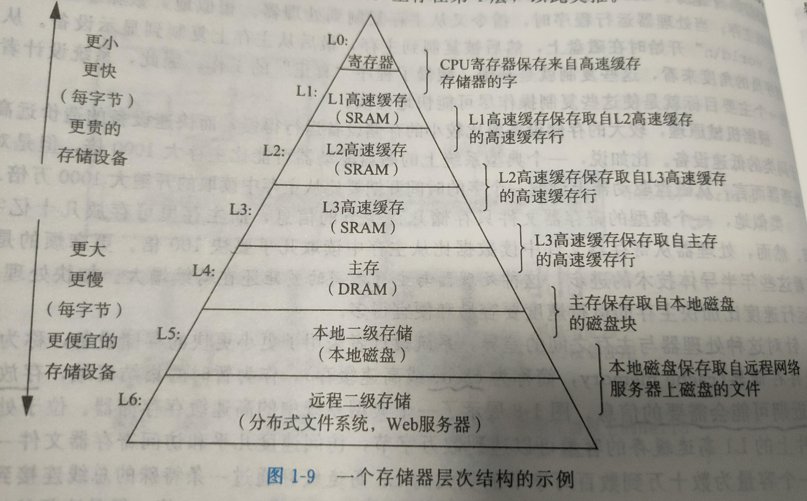

# 1.计算机系统漫游

## 1.1信息就是 位+上下文

区分不同数据对象的唯一方法就是我们读到这些数据对象时候的上下文。（char、int、double）

## 1.2程序被其他程序翻译成不同的格式

翻译可以分为**四个部分**：

**预处理阶段**：将头文件的内容赋值到源代码中，由`.c`文件生成`.i`文件

**编译阶段**：编译器`ccl`将文本文件`.i`编译为汇编文件`.S`，汇编语言是不同高级语言的不同编译器提供的**通用**的输出语言，不同平台下的汇编语言会有差异。

**汇编阶段**：汇编器`as`将`.s`文件翻译成机器语言指令，并且打包这些指令为`.o`文件，又称为**可重定位目标程序**，是一个二进制文件。

**链接阶段**：程序中可能使用到了类似`printf`函数这样的标准C库中的函数，因为我们的代码仅仅使用了函数接口而而没有函数实现，所以需要与其他已经预编译好的系统库二进制文件，比如`printf.o`进行合并，大概就是重新修改`printf`的函数地址为`printf.o`中的实现地址，所以`.o`文件叫做可重定位目标程序。合并以后生成`.exe`文件也就是**可执行目标文件**，可以被加载到内存中，由系统执行。

## 1.3 了解编译系统如何工作是大有益处的

## 1.4处理器读并解释储存在内存中的指令

程序计数器（PC）在任何时候都指向贮存中某条正在执行的机器语言指令。在`x86`平台下称其为`eip`；在`arm`平台下称其为`R15`

## 1.5高速缓存至关重要

高速缓存存储器，简称为**cache**或者高速缓存，储存处理器近期可能会需要的信息。

## 1.6存储设备形成层次结构

**上一层的储存器最为第一层存储器的高速缓存**

## 1.7 操作系统管理硬件

操作系统的两个功能：

1）防止硬件被失控的应用程序滥用（权限管理）；

2）向应用程序提供简单一致的机制来控制复杂而又大不相同的低级硬件设备。

操作系统的几个**抽象**概念：

**文件**：是对I/O设备的抽象表示

**虚拟内存**：是对主存和磁盘I/O这杯的抽象表示

**进程**：是对处理器、储存和I/O设备的抽象表示

 即**进程** 包括 **虚拟内存** 包括 **文件**

### 1.7.1 进程

一个进程的指令和另一个进程的指令是交错执行的，因此正在运行的进程数可以大于CPU核数，这种交错执行的机制称为**上下文切换**，简略操作是：保存房前进程的上下文，恢复新进程的上下文，将控制权传递到新进程。

从一个进程到另一个进程的切换是由操作系统**内核（kernel）**管理实现的。内核不是一个独立的进程，而是**系统管理全部进程所用代码和数据结构的集合**。

### 1.7.2 线程

一个进程可以由多个称为线程的执行单元组成，每个线程运行在**该进程的上下文**中，并且**共享**同样的代码和全局数据。

### 1.7.3 虚拟内存

虚拟内存为每个进程提供一个假象：每个进程都独占地使用所有主存。

虚拟地址空间（针对32位而言）：

低`2G`是应用程序使用，分别有：程序代码和数据、堆、共享库（`win`下的`dll`，`linux`下的`so`）、栈。

高`2G`是操作系统内核使用，并且所有进程共享。不允许应用程序读写这个区域的内容或者是直接调用这个区域的函数，比如调用内核来执行这些操作。

### 1.7.4 文件

文件按就是**字节序列**，每个I/O设备，包括键盘、磁盘、显示器，甚至网络，都可以看作是文件。

## 1.8系统之间利用网络通信

## 1.9 重要主题

### 1.9.1 Amdahl定律

当我们对系统的某个部分加速时，其对系统整体性能的影响取决于该部分的重要性和加速程度。

### 1.9.2 并发和并行

并发：☞一个同时具有多个活动的程序

并行：☞通过并发来是一个系统运行得更快

