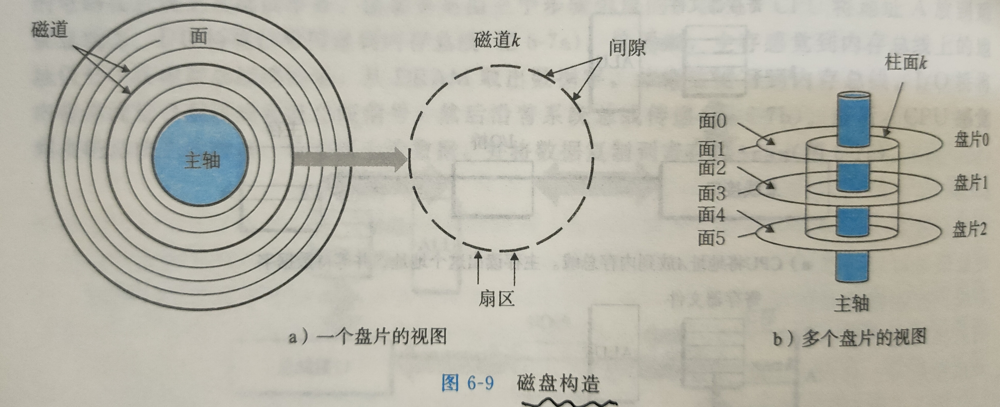

# 6. 存储器层次结构

## 6.1 存储技术

### 6.1.1 随即范根存储器

**静态随机访问存储器（SRAM）** 将每个喂存储在一个双稳态的储存单元里。只要有供电，SRAM的状态就不会发生改变，且对光或者电噪声的干扰不敏感。

**动态随机访问存储器（DRAM）** 将每个位存储为对一个电容的充电。电容的电压被扰乱之后就无法复原。

SRAM比DRAM更快，但是因为使用了更多的晶体管所以更贵并且耗能更大。

### 6.1.2 磁盘存储

#### 1. 磁盘构造 

磁盘是由**盘面**组成，每个盘面都有两面或者称为表面，其上覆盖着磁性记录材料。

每个表面是由一组称为**磁道（track）**的同心圆组成的。

每个磁道被划分为一组**扇区**。

每个扇区包含相等数量的数据位（通常为512字节）。

扇区之间由**间隙**隔开，间隙中不存储数据位，间隙储存用来表示扇区的格式化位。

磁盘制造厂商经常使用**柱面**来描述多个盘片的构造。柱面是所有盘片表面上到主轴中心的距离相等的磁道的集合。



#### 2. 磁盘容量

磁盘上可以记录的最大位数称为其容量，由以下技术因素决定：

**记录密度**：磁道一英寸的段中可以放入的位数

**磁道密度**：从盘片中心出发半径上一英寸的段内可以有的磁道数

**面密度**：记录密度和磁道密度之积

现代大容量的磁盘使用一种称为**多区记录**的技术。每个区包含一组连续的柱面，一个区中每个柱面中的每条磁道都有相同数量的扇区，所以这个扇区数量应该是由最里面的柱面的磁道决定的（最小同心圆）。

#### 3. 磁盘操作

磁盘用**读/写头**来读写存储在磁性表面的位。头连接在一个传动臂上，可以使得头可以到达任意的磁道上。头可以读取对应位的值，也可以改写对应位的值。每个盘片都有一个头。

#### 4. 逻辑磁盘块

为了维护磁盘这样复杂的结构，磁盘控制器维护**逻辑块号**与实际磁盘扇区之间的映射关系。每个逻辑块号对应着一个**（盘面、磁道、扇区）**的三元组，唯一的标识了对应的磁盘区域。

#### 5. 连接I/O设备

系统总线和内存总线是与CPU相关的。而I/O总线是与CPU无关的。虽然I/O总线比系统总线与内存总线慢，但是他可以兼容多种第三方I/O设备。一般可以分为以下三种类型设备：

**通用串行总线（Universal Serial Bus，USB）**：包括键盘、鼠标、打印机、固态硬盘

**图形卡（或图形适配器 GPU）**：显卡嘛

**主机总线适配器**：SCSI、SATA

#### 6. 访问磁盘

CPU使用一种称为**内存映射I/O**的技术来向I/O设备发射命令。在使用内存映射I/O的系统中，地址空间中由一块地址是为了与I/O设备通讯保留的。每个这样的地址称为一个I/O端口。当一个设备连接到总线，它就与一个或者多个端口相关联（或者称为被映射到端口）。

设备可以自己执行读或者写总线事务而不需要CPU干涉的过程称为**直接内存访问**。

### 6.1.3 固态硬盘

固态硬盘（SSD）是一种基于**闪存**的存储技术。一个SSD封装由一个或者多个闪存芯片和闪存翻译层组成。芯片替代传统旋转磁盘中的机械驱动器，翻译层则扮演与磁盘控制器相同的角色。

**读SSD比写要更快**

一个闪存由B个块的序列组成，每个块由P页组成。当前计算机中页的大小为4KB。数据是以页为单位读写的，只有在一页所处的块整个被擦除之后，才可以写这一页（应该就是**页对齐**）。

大约进行100 000次重复写之后，块就会被磨损坏而不能再使用。

## 6.2 局部性

**局部性原理**：计算机程序倾向于引用邻近于其他最近使用过的数据项的数据项（空间局部性），或者最近引用过的数据项本身（时间局部性）。

**有良好局部性的程序比局部性差的程序运行得更快**

通过引入称为**高速缓存存储器**的小而快速的存储器来保存最近被引用的指令和数据项，从而提高对储存的访问速度。

### 6.2.1 对程序数据引用的局部性

```c
int sunvec(int a[N][N])
{
    int i, j, sum = 0;
    for(i = 0; i < N; i++)
        for(j = 0; j < N; j++)
            sum += a[i][j]
    return sum; 
}
```

对`sum`而言由于一直在访问，有良好的时间局部性。

对于数据a而言，一直是步长为1地对其访问，所以有良好的空间局部性。

如果修改为这样，步长很大，就没有良好的空间局部性了。

```c
for(j = 0; j < N; j++)
        for(i = 0; i < N; i++)
            sum += a[i][j]
```

### 6.2.2 取指令的局部性

## 6.3 存储器层次结构

最快的是少量的CPU寄存器，CPU可以在一个时钟周期内访问它们。

### 6.3.1 存储器层次结构中的缓存

存储器层次结构的中心思想是：对于每个`k`，位于`k`层的更快更小的存储设备哦作为位于`k+1`层的更大更慢的存储设备的缓存。

数据总是以**块（chunk）**大小为传送单位，在第`k`层和第`k+1`层之间来回复制的。任何一对相邻层之间的块大小是固定的，但是不同相邻层组之间可以有不同的相邻快，比如`k`层与`k+1`层之间的块大小为`A`，`k`层与`k-1`层之间的块大小可以为`B`。

#### 1.缓存命中

当需要k+1层的某个数据对象d时，首先回到k层的一个缓存块中寻找d，如果找到了就是所说的**缓存命中**，直接读取k层的d就行了。

#### 2.缓存不命中

当第k层没有对象d的时候，就是缓存不命中，需要去k+1层寻找，并且将d放在k层的缓存块中。如果k层的缓存块已经用完了，那么就可能会覆盖某一个块，覆盖的策略有**随机替换策略**、**最近最少被使用（LRU）替换策略**。

## 6.5 编写高速缓存友好的代码

有以下确保代码对高速缓存友好的基本方法：

1. **让最常见的情况运行得最快**。

2. **尽量减少每个循环内部的缓存不命中数量**。


