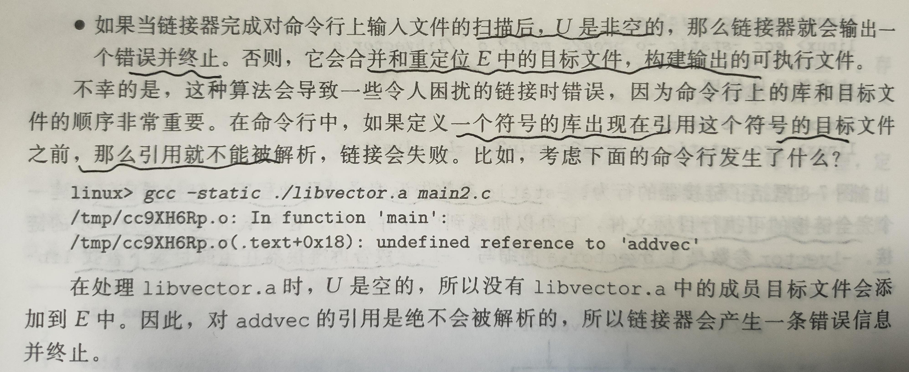

# 7. 链接

## 7.1编写驱动程序

1. C预处理器（`cpp`）将`main.c`翻译成ASCII中间文件`main.i`

2. 后C编译器（`ccl`）将`main.i`翻译成ASCII汇编语言文件`main.s`

3. 汇编器（`as`）将`main.s`翻译成可重定位目标文件`main.o`

4. 链接器（`ld`）将所有可重定位目标文件整合为可执行目标文件

**详细说明见1.2**

## 7.2 静态链接

为了构造可执行文件，链接器需要完成两个主要任务

1. **符号解析**。每个符号对应于一个函数、一个全局变量、一个静态变量（static修饰的），符号解析的目的是将每个符号引用正好和一个符号定义关联起来。
2. **重定位**。使用汇编器产生的**重定位条目**，修改所有符号的引用使得其指向正确的内存地址（以前是不正确的）。

## 7.3 目标文件

目标文件有三种：

1. **可重定位目标文件**。`.o`文件
2. **可执行目标文件**。`.exe`文件、`elf`文件
3. **共享目标文件**。`.dll`文件、`.so`文件

编译器和汇编器生成可重定位目标文件和共享目标文件，链接器生成可执行目标文件。

## 7.4 可重定位目标文件

以`ELF`文件为例。其可重定位目标文件包含以下几个节

**.text**：已编译程序的机器代码

**.rodata**：只读数据，比如`printf`中的格式串和`switch`语句的跳转表

**.data**：已初始化的全局和静态C变量。局部变量储存在堆栈里面。

**.bss**：未初始化的全局和静态C变量，以及所有被初始化为0的全局或静态变量。这个节在目标文件中不占实际空间，仅仅是一个占位符。运行的时候，在内存中为这些变量都初始化为0

**.symtab**：一个符号表。存放程序中定义和引用的函数和全局变量的信息。

**.rel.text**：一个.text节中位置的列表，当链接器把这个目标文件和其他文件组合时，需要修改这些位置。

**.rel.data**：被模块引用或定义的所有全局变量的重定位信息。

**.debug**：一个调试符号表。

**.line**：原始C源程序中的行号和.text节中机器指令之间的映射。

**.strtab**：包括了`.symtab`和`.debug`节中的符号，是以null结尾的字符串序列。

## 7.5  符号和符号表

三种不同的符号：

1. 由模块m定义并能被其他模块引用的全局符号。对应于非静态的C函数和全局变脸
2. 由其他模块定义并被模块m引用的全局符号，称为外部符号。对应其他模块中定义的非静态C函数和全局变量。
3. 只被模块m定义和引用的局部符号。对应带static属性的C函数和全局变量。这些符号在模块m中任何位置可见，但是不能被其他模块引用。

对于以下这种情况，编译器会向汇编器出书两个而不同名字的局部链接器符号

```c
int f()
{
    static int x = 0;
    return x;
}
int g()
{
    static int x = 1;
    return x;
}
```

**static的小解释**

static属性对应了Java中的private属性。其中C源文件扮演模块的角色，任何带有static属性生命的全局变量或者函数都是模块私有的（private）；不带static属性的全局变量或者函数都是公共的（public），可以被其他模块访问。

**符号表是由汇编器创建的。**

## 7.6 符号解析

链接器解析符号引用的方法是将每个引用与它输入的可重定位目标文件的符号表中的一个确定的符号定义关联起来。编译器只允许每个模块中每个全局变量由一个定义。静态局部变量也会有本地链接器符号，并且确保它们有**唯一**的名字。

当编译器遇到一个不是在当前模块中定义的符号时，会假设该符号实在其他某个模块定义，生成一个**链接器符号条目**，把它交给链接器处理。如果链接器在它输入的所有模块中都找不到条目对应的符号，那么就会输出一条错误信息并且终止。

### 7.6.1 链接器如何解释多重定义的全局符号

编译器向汇编器输出每个全局符号分为两类：**强符号**和**弱符号**。函数和已经初始化的全局变量是强符号，未初始化的全局变量是弱符号。链接器对多重定义的符号定义以下规则：

1. 不允许有多个同名的强符号。
2. 如果有一个强符号和多个弱符号同名，选择强符号
3. 如果有多个弱符号同名，随机选择一个弱符号（警告而不报错，所以编程的时候尤其需要注意这点）

针对规则3，为了避免出现多弱符号的情况，可以在编译阶段加上`-fno-common`来触发一个错误，或者直接打开`-Werror`选项，会将警告视为错误。

### 7.6.2 与静态库链接

当模块与静态库（`libnary`）链接的时候，只会复制静态库中需要用到的模块。

在Linux下要创建一个静态库，使用AR工具，如下：

```shell
gcc -c addvec.c multvec.c
ar rcs libvector.a addvec.o multvec.o
```

### 7.6.3 链接器如何使用静态库来解析应用

~~太难顶了不想码字了~~




## 7.7 重定位

重定位由两步组成：

1. **重定位节和符号定义**：链接器将所有相同类型的节合并在一起。
2. **重定位节中的符号引用**：链接器修改代码节和数据节中对每个符号的引用，使得他们指向正确的运行时地址。这一步依赖于可重定位模块中称为**重定位条目**的数据结构。

### 7.7.1 重定位条目

汇编器每当遇到一个位置未知的目标引用，都会生成一个重定位条目，告诉链接器在合并的时候如何修改这个引用。代码的重定位条目放在`.rel.text`中，已初始化数据的重定位条目放在`.rel.data`中。

以下是重定位条目的格式

```c
typedef struct{
    long offset; // 需要被修改引用的节偏移
    long type:32, // 重定位类型
    	 symble:32; // 被修改后引用应该只想该符号
    long addend; // 一些类型的重定位需要最偏移做调整  一般是加上addend
} ELF64_Rela;
```

重定位类型最基本的两种：`R_X86_64_P32`：重定位一个使用32为PC**相对地址**的引用、`R_X86_64_32`：重定位一个使用32位**绝对地址**的引用。

## 7.8 可执行目标文件

其中有一个`.init`的节，定义了叫做`_init`的函数，在程序的初始化代码会调用它（比main函数早）。

可执行文件的**对齐**是一种优化，能够使程序执行的时，目标文件中的段能够更有效率地传到内存中。

## 7.9 加载可执行目标文件

在`linux`下通过shell执行某个可执行目标文件，会通过调用某个驻留在存储器中的称为加载器（loader）的操作系统代码来运行它。程序也可以使用`execve`来调用加载器。

加载器将可执行文件中的代码和数据从磁盘复制到内存，然后通过跳转到程序的第一条指令或者入口点来运行该程序。将这个程序**复制**到内存并**运行**的过程叫做**加载**

程序入口点是叫做`_start`的函数，实在系统目标文件`ctrl.o`中定义的。`_start`函数调用系统启动函数`__libc_start_main`，该函数定义在`libc.so`中，它初始化执行环境，调用用户层的main函数。

## 7.10 动态链接共享库

静态库有一些缺点：如果程序员需要使用一个库的最新版本，需要将程序与新的库重新链接，链接的过程往往最耗时和耗内存。另一个缺点是每次都要复制内容到每一个需要的程序空间中去，对稀缺的内存系统资源的极大浪费。（内存的一个有趣属性就是不论系统内存有多大，他总是一种稀缺资源）。

共享库是致力于解决静态库缺陷的产物。共享库是一个目标模块，在运行或加载时，可以加载到任意的内存地址，并和一个内在内存中的程序链接起来，这个过程称为**动态链接**，是由一个叫做动态链接器的程序来执行的。

在内存中，一个共享库的`.text`节的一个副本可以被不同的正在运行的进程共享。

`-shared`选项指示链接器创建一个共享的目标文件。

可执行目标文件里面有一个`.interp`的节，包含动态链接器的路径名，动态链接器本身就是一个共享目标。动态链接器通过执行下面的重定位完成链接任务：

1. 重定位`libc.so`的文本和数据到某个内存段
2. 重定位自己的so文件到另一个内存段
3. 重定位程序中所有对`libc.so`和自己的so定义的符号引用

最后动态链接器将控制传递给程序，从这时候开始共享库的位置就固定了，并且程序执行过程中不会改变。

## 7.11 从应用程序中加载和链接共享库

```c
#include <dlfcn.h>
void *dlopen(const char *filename, int flag); //成功返回句柄指针，失败返回NULL
// flag : RTLD_NOW 马上解析符号    RTLD_LAZY   执行库代码的时候解析符号
```

这是Linux为程序提供的接口，可以让程序在运行时候加载和链接共享库。

```c
#include <dlfcn.h>
int dlsym(void *handle, char* symbol);
```

`dlsym`函数的输入是一个指向前面已经打开了的共享库的句柄和一个symbol名字，返回符号的地址。

```c
#include <dlfcn.h>
int dlclose(void *handle);
```

如果没有其他共享库在使用这个共享库，就可以用`dlclose`函数卸载该共享库。

## 7.12 位置无关代码

如果一个系统有成百个库和库的各种版本，就很难避免地址空间分裂成大量小的、未使用而又不再能使用的小洞。我们需要可以加载到内存任何位置而无需链接器修改的东西。

可以加载而无需重定位的代码称为**位置无关代码（Position-Independent Code）**，可以使用`-fpic`来生成。

#### 1. PIC数据引用

每个模块中的数据以及代码的**相对位置**都是不会变化的，是一个运行时常量。

PIC利用了这个特性，在数据段开始的地方创建一个叫做全局偏移表（Global Offset Table，GOT）。GOT中每个被这个模块引用的全局数据都有一个8字节的条目，编译器还为每个条目生成一个重定位记录。加载的时候，动态链接器会重定位GOT中的每个条目。每个引用全局目标的目标模块都有自己的GOT。

#### 2. PIC函数调用

将过程地址的绑定推迟到第一次调用该过程的时候的技术称为**延迟绑定**，能够避免动态链接器在加载时进行成百上千个其实不需要的重定位。

延迟绑定的段叫做`.plt`


