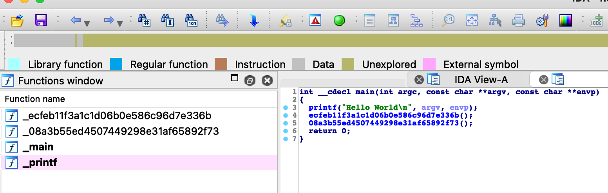

# LLVM学习

## LLVM编译以及CLion调试

### 编译

下载project.src源码，使用Clion打开llvm目录下的CMakeLists.txt，然后cmake选项里面的参数如下填写


```shell
-G Ninja -DLLVM_ENABLE_PROJECTS="clang;lldb;libcxx;libcxxabi" # 工具之间用 ; 隔开
```

**NOTE:  编译lldb需要libcxx，而libcxx需要libcxxabi**

这里使用Ninja编译，因为用的Clion，里面已经制定了编译版本，否则默认编译Debug版本，需要用`-DMAKE_BUILD_TYPE=Release`来制定编译Release版本。`-DLLVM_ENABLE_PROJECTS`则是制定编译那些工具，工具之间用分号隔开即可。

一切修改好保存之后，Clion回自动重新生成cmake-build-degub等文件夹，这时候就不用Clion，直接终端用Ninja编译即可。

不清楚为什么生成的clang没有SDK，需要手动指定，这里使用xcode的，路径一般固定

```shell
-isysroot /Applications/Xcode.app/Contents/Developer/Platforms/MacOSX.platform/Developer/SDKs/MacOSX.sdk
```

llvm编译过程中也有中间代码，分别是ll与bc文件

```shell
clang hello.c -emit-llvm -S -o hello.ll # 仍然要加-isysroot 
lli ./hello.ll             # lli 为ll文件的解释器
# ll相当于是中间语言 与平台无关 
```

```shell
llvm-as hello.ll -o hello.bc   # 仍然要加-isysroot 
lli ./hello.bc              # lli 也是bc文件的解释器
```

```shell
clang hello.bc -o hello     # 最后用clang就得到最终的可执行文件  仍然要加-isysroot 
```

### 调试

需要在文件`/llvm/clang/tool/driver/driver.cpp`中main下断点，选择degub版本下的clang进行调试，参数则是填写正常编译需要的参数，比如

```shell
-isysroot /Applications/Xcode.app/Contents/Developer/Platforms/MacOSX.platform/Developer/SDKs/MacOSX.sdk /Users/liuxingyu/Desktop/vscode/android/a.c -o /Users/liuxingyu/Desktop/vscode/android/a_clion # 最前面的clang需要省略
```


之后点击调试就可以断下来了，效果如下


## LLVM PASS

### 内部编译pass

这是llvm12.0.0写pass的官方[教程](https://releases.llvm.org/12.0.0/docs/WritingAnLLVMPass.html#quick-start-writing-hello-world)

这里新创建一个叫做EncoderFunctionName的模块，文件内容为

```cmake
add_llvm_library( LLVMEncoderFunctionName MODULE EncoderFunctionName.cpp PLUGIN_TOOL opt)
#模块中的CmakeLists.txt    LLVMEncoderFunctionName为模块名称
```

```cmake
add_subdirectory(EncoderFunctionName) # Transforms目录下的CmakeLists.txt 添加的
```

```c++
#include "llvm/ADT/SmallString.h"
#include "llvm/IR/Function.h"
#include "llvm/IR/LegacyPassManager.h"
#include "llvm/Pass.h"
#include "llvm/Support/raw_ostream.h"
#include "llvm/Transforms/IPO/PassManagerBuilder.h"

using namespace llvm;
namespace {
    struct EncoderFunctionName : public FunctionPass {
        static char ID;
      
        EncoderFunctionName() : FunctionPass(ID) {}
      
        bool runOnFunction(Function &F) override {
            errs() << "EncoderFunctionName: " << F.getName() << " -> ";
            if (F.getName().compare("main") != 0) {
                llvm::MD5 Hasher;
                llvm::MD5::MD5Result Hash;
                Hasher.update("llvm_encode_");
                Hasher.update(F.getName());
                Hasher.final(Hash);

                SmallString<32> HexString;
                llvm::MD5::stringifyResult(Hash, HexString);
                F.setName(HexString);
            }
            errs() << F.getName() << "\n";
            return false;
        }
    }; // end of struct Hello
} // end of anonymous namespace
char EncoderFunctionName::ID = 0;
static RegisterPass<EncoderFunctionName> X("encode", "EncoderFunctionName Pass",
                                           false /* Only looks at CFG */,
                                           false /* Analysis Pass */);
static llvm::RegisterStandardPasses
        Y(llvm::PassManagerBuilder::EP_EarlyAsPossible,
          [](const llvm::PassManagerBuilder &Builder,
             llvm::legacy::PassManagerBase &PM) {
              PM.add(new EncoderFunctionName());
          });
```

````shell
ninja LLVMEncoderFunctionName # 单独编译模块   会得到一个动态链接库
opt -load /lib/LLVMEncoderFunctionName.dylib -encode hello.ll -o hello.bc
# 用opt工具加载模块 使用-encode参数 将中间ll文件编译为二进制bc文件
clang hello.bc -o hello # 用得到的bc文件继续编译出的可执行文件  可以拖进ida查看被修改后的函数名
````




### 外部编译pass

官方[教程](https://llvm.org/docs/CMake.html#cmake-out-of-source-pass)

mac下需要修改clang使用c++14，参数为`-std=c++14`,最后编译出来找不到符号很无语。

解决了符号问题！！！！！！！      

报错如下

```shell
Undefined symbols for architecture x86_64:
  "llvm::FunctionPass::assignPassManager(llvm::PMStack&, llvm::PassManagerType)", referenced from:
      vtable for (anonymous namespace)::Hello in Hello.o
 # .....   相同的找不到符号错误
```

谷歌出来的原因是没有找到llvm的lib库，这个解答是正确的，但是缺少了正对cmake的解决方案（网络上都是MakeFile的语法），既然找不到库那就自己链接库。

首先使用`llvm-config --libs`找出所有可以的库，名字都是以`-lLLVM`起头，需要删除才是库的libname。然后通过`llvm_map_components_to_libnames`把所有库都链接到一个符号表内，用法是

```shell
llvm_map_components_to_libnames(mylibname libname libname ...)   # mylibname是自己的符号 
```

然后用target_link_libraries链接符号

```shell
target_link_libraries(LLVMObfuscationPass ${llvm_libs}) # LLVMObfuscationPass就是工具名
```

这两句放进Obfuscation中的CMakeLists.txt就行了！！！

## OLLVM

### 编译Obfuscation

llvm12.0.0编译出问题了，换成llvm9.0.1编译通过，其中有这么几个地方需要注意

1.分别在lib和include/llvm里面添加obfuscation文件夹，include/llvm里面还有一个CryptoUtils.h文件添加

2.lib中以及llvm文件夹中的LLVMBuild.txt文件修改，CMakeLists.txt的文件修改

3.PassManagerBuilder.cpp中不仅要添加头文件，还有几行代码

```cpp
// Flags for obfuscation
static cl::opt<bool> Flattening("fla", cl::init(false),
                                cl::desc("Enable the flattening pass"));

static cl::opt<bool> BogusControlFlow("bcf", cl::init(false),
                                      cl::desc("Enable bogus control flow"));

static cl::opt<bool> Substitution("sub", cl::init(false),
                                  cl::desc("Enable instruction substitutions"));

static cl::opt<std::string> AesSeed("aesSeed", cl::init(""),
                                    cl::desc("seed for the AES-CTR PRNG"));

static cl::opt<bool> Split("split", cl::init(false),
                           cl::desc("Enable basic block splitting"));

PassManagerBuilder::PassManagerBuilder() {} /// 这行之前添加以上部分
```

```cpp
  MPM.add(createSplitBasicBlock(Split));
  MPM.add(createBogus(BogusControlFlow));
  MPM.add(createFlattening(Flattening));
  MPM.add(createSubstitution(Substitution));

  if (OptLevel == 0) {} /// 这行之前添加以上部分
```

```cpp
  MPM.add(createSubstitution(Substitution));

  addExtensionsToPM(EP_OptimizerLast, MPM); /// 这行之前添加以上部分
```

4.Flattening.cpp需要添加头文件

```cpp
#include "llvm/Transforms/Utils.h"  // 需要使用createLowerSwitchPass函数
```

5.BogusControlFlow.cpp需要修改变量类型

```cpp
// TerminatorInst * tbb= fi->getTerminator();
Instruction * tbb= fi->getTerminator(); // 上面这个的返回类型改为Instruction
```


之后使用`ninja LLVMObfuscation`编译ollvm，再`ninja clang`重新编译clang使得clang可以支持Obfuscation

ollvm的[特性手册](https://github.com/obfuscator-llvm/obfuscator/wiki/Features) 

