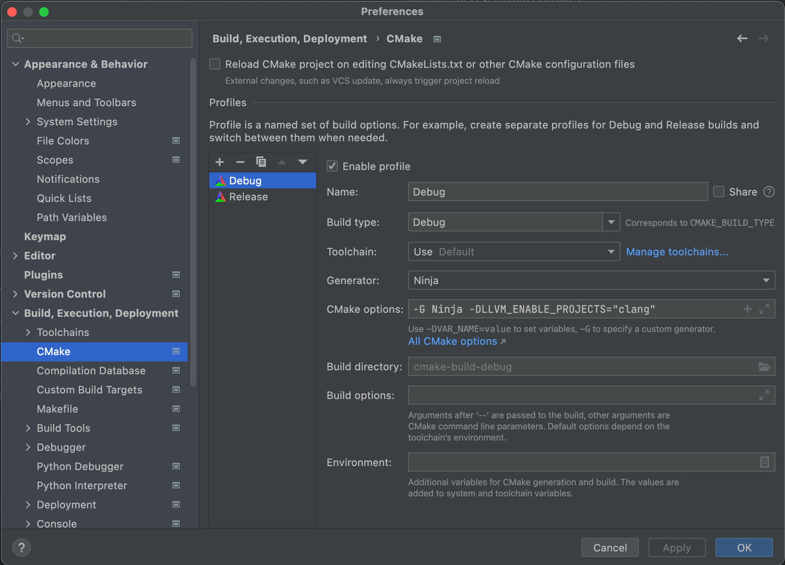
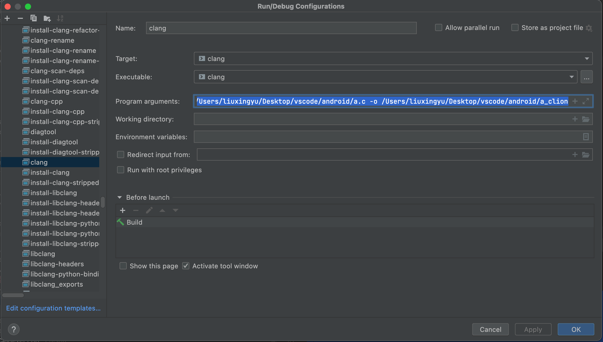
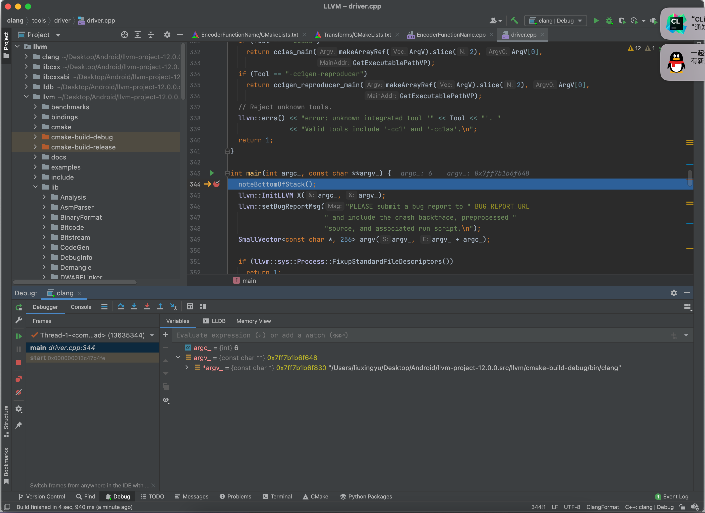

# LLVM学习

## LLVM编译以及CLion调试

### 编译

下载project.src源码，使用Clion打开llvm目录下的CMakeLists.txt，然后cmake选项里面的参数如下填写



```shell
-G Ninja -DLLVM_ENABLE_PROJECTS="clang;lldb;libcxx;libcxxabi" # 工具之间用 ; 隔开
```

**NOTE:  编译lldb需要libcxx，而libcxx需要libcxxabi**

这里使用Ninja编译，因为用的Clion，里面已经制定了编译版本，否则默认编译Debug版本，需要用`-DMAKE_BUILD_TYPE=Release`来制定编译Release版本。`-DLLVM_ENABLE_PROJECTS`则是制定编译那些工具，工具之间用分号隔开即可。

一切修改好保存之后，Clion回自动重新生成cmake-build-degub等文件夹，这时候就不用Clion，直接终端用Ninja编译即可。

不清楚为什么生成的clang没有SDK，需要手动指定，这里使用xcode的，路径一般固定

```shell
-isysroot /Applications/Xcode.app/Contents/Developer/Platforms/MacOSX.platform/Developer/SDKs/MacOSX.sdk
```

llvm编译过程中也有中间代码，分别是ll与bc文件

```shell
clang hello.c -emit-llvm -S -o hello.ll # 仍然要加-isysroot 
lli ./hello.ll             # lli 为ll文件的解释器
```

```shell
llvm-as hello.ll -o hello.bc   # 仍然要加-isysroot 
lli ./hello.bc              # lli 也是bc文件的解释器
```

```shell
clang hello.bc -o hello     # 最后用clang就得到最终的可执行文件  仍然要加-isysroot 
```

### 调试

需要在文件`/llvm/clang/tool/driver/driver.cpp`中main下断点，选择degub版本下的clang进行调试，参数则是填写正常编译需要的参数，比如

```shell
-isysroot /Applications/Xcode.app/Contents/Developer/Platforms/MacOSX.platform/Developer/SDKs/MacOSX.sdk /Users/liuxingyu/Desktop/vscode/android/a.c -o /Users/liuxingyu/Desktop/vscode/android/a_clion # 最前面的clang需要省略
```



之后点击调试就可以断下来了，效果如下

