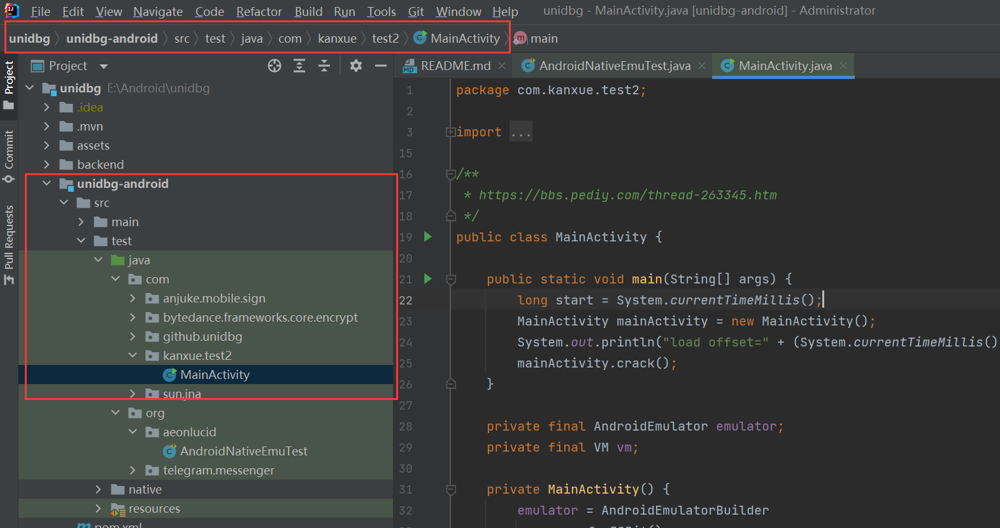

# Unicorn

## unicorn 上手

```c
// 内存相关函数
uc_mem_map;  uc_mem_read;  uc_mem_write;  
//寄存器相关函数
uc_reg_read;  uc_reg_write;

// 指令执行类宏
UC_HOOK_INTR  UC_HOOK_INSN  UC_HOOK_CODE  UC_HOOK_BLOCK
// 内存访问类宏 一般用这个来进行type判断
UC_HOOK_MEM_READ  UC_HOOK_MEM_WRITE  UC_HOOK_MEM_FRTCH
// 异常处理类宏    UNMAPPED就是没有被map的区域  是不可以访问的 一般用这个来进行HOOK
UC_HOOK_MEM_READ_UNMAPPED  UC_HOOK_MEM_WRITE_UNMAPPED  UC_HOOK_MEM_FRTCH_UNMAPPED
```

回调函数的接口可以在unicorn函数源码中的`unicorn.h`中找到。python编写回调函数只需要对应参数即可，返回值为真就继续模拟执行，为假就终止模拟执行，默认返回值应该是真

一个样例

```python
# unicorn_example1.py

import binascii
import capstone
import unicorn


def printArm32Regs(mu):  # 打印寄存器
    for i in range(66, 78 + 1):
        # for i in range(66, 66 + 4):
        print("R%d, vaule:0x%x" % (i - 66, mu.reg_read(i))) # 需要使用reg_read来读寄存器
    # UC_ARM_REG_SP = 12
    print("SP, vaule:0x%x" % (mu.reg_read(12)))

# typedef void (*uc_cb_hookcode_t)(uc_engine *uc, uint64_t address, uint32_t size, void *user_data);
def hook_code(mu, address, size, user_data):  # 按照源码中都函数原型写参数就行了
    print("-----------------------------")
    code = mu.mem_read(address, size)
    CP = capstone.Cs(capstone.CS_ARCH_ARM, capstone.CS_MODE_THUMB)  # 指定指令的平台以及模式
    for i in CP.disasm(code, 0, len(code)):  # 返回反汇编
        print("[addr:%x]:%s %s" % (address, i.mnemonic, i.op_str))
    printArm32Regs(mu)
    print("-----------------------------")
    return True

# typedef bool (*uc_cb_eventmem_t)(uc_engine *uc, uc_mem_type type,uint64_t address, int size, int64_t value,void *user_data);
def hook_mem_unmapped(mu, type, address, size, value, user_data):
    print("-----------------------------")
    if type == unicorn.UC_MEM_WRITE_UNMAPPED: # 这里不能用UC_HOOK_MEM_WRITE_UNMAPPED
        print("UC_MEM_WRITE_UNMAPPED ->  adddress:0x%x --- size:0x%x" % (address, size))
        mu.mem_map(address & 0x1000, 0x1000)
    print("-----------------------------")
    return True


def hook_mem(mu, type, address, size, value, user_data):
    print("-----------------------------")
    if type == unicorn.UC_MEM_WRITE:
        print("UC_MEM_WRITE ->  adddress:0x%x --- size:0x%x" % (address, size))
    print("-----------------------------")
    return True

# typedef void (*uc_cb_hookintr_t)(uc_engine *uc, uint32_t intno, void *user_data);
def hook_mem_system_call(mu, intno, user_data):
    print("-------------hook_mem_system_call----------------")
    printArm32Regs(mu)
    print("-----------------------------")
    return True

if __name__ == '__main__':
    # MOV R2, R1
    # MOV R3, R0
    # CODE = b'\x0a\x46\x03\x46\x04\x92\x4f\xf0\x01\x07\x00\xdf'
    CODE = b'\x0a\x46\x03\x46\x04\x92\x4f\xf0\x01\x07'
    CP = capstone.Cs(capstone.CS_ARCH_ARM, capstone.CS_MODE_THUMB)  # 指定指令的平台以及模式
    for i in CP.disasm(CODE, 0, len(CODE)):  # 返回反汇编
        print("[addr:%x]:%s %s" % (i.address, i.mnemonic, i.op_str))
    mu = unicorn.Uc(unicorn.UC_ARCH_ARM, unicorn.UC_MODE_THUMB)  # 创建模拟器 指定平台与模式
    ADDRESS = 0x1000
    SIZE = 1024
    mu.mem_map(ADDRESS, SIZE)  # 映射内存  可以看作是申请可以被使用的内存
    mu.mem_write(ADDRESS, CODE)  # 写入指令
    mu.reg_write(unicorn.arm_const.UC_ARM_REG_R0, 0x100)
    mu.reg_write(unicorn.arm_const.UC_ARM_REG_R1, 0x200)
    mu.reg_write(unicorn.arm_const.UC_ARM_REG_R2, 0x300)
    mu.reg_write(unicorn.arm_const.UC_ARM_REG_R3, 0x400)  # 写寄存器

    mu.hook_add(unicorn.UC_HOOK_CODE, hook_code)  # 所有指令都hook
    # mu.hook_add(unicorn.UC_HOOK_BLOCK,hook_block) # 所有基本快的hook
    mu.hook_add(unicorn.UC_HOOK_MEM_WRITE, hook_mem)  # hook内存写
    mu.hook_add(unicorn.UC_HOOK_MEM_WRITE_UNMAPPED, hook_mem_unmapped)  # hook没有map都内存写
    mu.hook_add(unicorn.UC_HOOK_INTR, hook_mem_system_call)  # hook system call
    try:
        mu.emu_start(ADDRESS + 1, ADDRESS + len(CODE))  # 模拟执行      arm下 执行地址 = 指令地址 + 1
        print("*********** after emu_start **************")
        printArm32Regs(mu)
        bytes = mu.mem_read(ADDRESS, 0x10)  # 读取内存 返回 bytearray
        print("ADDRESS:%x,content:%s" % (ADDRESS, binascii.b2a_hex(bytes)))
    except unicorn.UcError as e:
        print(e)

    readaddr = mu.reg_read(unicorn.arm_const.UC_ARM_REG_SP) + 0x10
    stack = mu.mem_read(readaddr, 2)
    print("STACK:%x,content:%s" % (readaddr, binascii.b2a_hex(stack))) # 检查是否写入成功
```


## unicorn调用so中函数

大概就是把所有CODE都写进去，然后利用函数在IDA中的偏移来计算实际的运行位置，如果遇到库函数可以直接`nop`掉并且在该位置hook，并且在回调函数中自己实现库函数。

`ARM32`中函数参数小于等于4个的部分用`R0~R3`寄存器传递，大于4个的部分用栈传递

`ARM64`中函数参数小于等于8个的部分用`X0~X7`寄存器传递，大于8个的部分用栈传递

一个样例

```python
# unicorn_example2.py

import binascii
import struct
import capstone
import unicorn


def printArm32Regs(mu):  # 打印寄存器
    for i in range(66, 78 + 1):
        # for i in range(66, 66 + 4):
        print("R%d, vaule:0x%x" % (i - 66, mu.reg_read(i)))  # 需要使用reg_read来读寄存器
    # UC_ARM_REG_SP = 12
    print("SP, vaule:0x%x" % (mu.reg_read(12)))


def readString(mu, address):
    str = ''
    tmp = mu.mem_read(address, 1)
    while (tmp[0] != 0):
        str = str + chr(tmp[0])
        address = address + 1
        tmp = mu.mem_read(address, 1)
    return str


# typedef void (*uc_cb_hookcode_t)(uc_engine *uc, uint64_t address, uint32_t size, void *user_data);
def hook_code(mu, address, size, user_data):  # 按照源码中都函数原型写参数就行了
    if address == 0x1000 + 0x8CE8:
        print("----------call strstr--------")
        R0value = readString(mu, mu.reg_read(unicorn.arm_const.UC_ARM_REG_R0))
        R1value = readString(mu, mu.reg_read(unicorn.arm_const.UC_ARM_REG_R1))
        print('%s ------ %s' % (R0value, R1value))
        if R0value.find('add') == -1:
            mu.reg_write(unicorn.arm_const.UC_ARM_REG_R0, 0)
        else:
            mu.reg_write(unicorn.arm_const.UC_ARM_REG_R0, 1)
    print("-----------------------------")
    code = mu.mem_read(address, size)
    CP = capstone.Cs(capstone.CS_ARCH_ARM, capstone.CS_MODE_THUMB)  # 指定指令的平台以及模式
    for i in CP.disasm(code, 0, len(code)):  # 返回反汇编
        print("[addr:%x]:%s %s" % (address, i.mnemonic, i.op_str))
    printArm32Regs(mu)
    print("-----------------------------")


# typedef bool (*uc_cb_eventmem_t)(uc_engine *uc, uc_mem_type type,uint64_t address, int size, int64_t value,void *user_data);
def hook_mem_unmapped(mu, type, address, size, value, user_data):
    print("-----------------------------")
    if type == unicorn.UC_MEM_WRITE_UNMAPPED:
        print("UC_MEM_WRITE_UNMAPPED ->  adddress:0x%x --- size:0x%x" % (address, size))
        mu.mem_map(address & 0x1000, 0x1000)
    print("-----------------------------")
    return True


def hook_mem(mu, type, address, size, value, user_data):
    print("-----------------------------")
    if type == unicorn.UC_MEM_WRITE:
        print("UC_MEM_WRITE ->  adddress:0x%x --- size:0x%x" % (address, size))
    print("-----------------------------")


# typedef void (*uc_cb_hookintr_t)(uc_engine *uc, uint32_t intno, void *user_data);
def hook_mem_system_call(mu, intno, user_data):
    print("-------------hook_mem_system_call----------------")
    printArm32Regs(mu)
    print("-----------------------------")


if __name__ == '__main__':
    # MOV R2, R1
    # MOV R3, R0
    # CODE = b'\x0a\x46\x03\x46\x04\x92\x4f\xf0\x01\x07\x00\xdf'
    CODE = b''
    with open('so/libunicorn_example2.so', 'rb+') as f:
        CODE = f.read()
    CP = capstone.Cs(capstone.CS_ARCH_ARM, capstone.CS_MODE_THUMB)  # 指定指令的平台以及模式
    print('----------add--------------')
    for i in CP.disasm(CODE[0x8CA0:], 0, 10):  # 返回反汇编
        print("[addr:%x]:%s %s" % (0x8CA0 + i.address, i.mnemonic, i.op_str))
    print('----------add--------------')
    print('----------add_if--------------')
    for i in CP.disasm(CODE[0x8CB4:], 0, 45):  # 返回反汇编
        print("[addr:%x]:%s %s" % (0x8CB4 + i.address, i.mnemonic, i.op_str))
    print('----------add_if--------------')
    mu = unicorn.Uc(unicorn.UC_ARCH_ARM, unicorn.UC_MODE_THUMB)  # 创建模拟器 指定平台与模式
    ADDRESS = 0x1000
    SIZE = 10 * 1024 * 1024
    mu.mem_map(ADDRESS, SIZE)  # 映射内存  可以看作是申请可以被使用的内存
    mu.mem_write(ADDRESS, CODE)  # 写入指令
    mu.mem_write(ADDRESS + 0x8CE8, b'\x00\xbf\x00\xbf')

    mu.mem_map(ADDRESS + SIZE + 0x1000, 1024)  # 映射内存  可以看作是申请可以被使用的内存
    mu.mem_write(ADDRESS + SIZE + 0x1000, b'flag')

    mu.reg_write(unicorn.arm_const.UC_ARM_REG_R0, ADDRESS + SIZE + 0x1000)
    mu.reg_write(unicorn.arm_const.UC_ARM_REG_R1, 0x2)
    mu.reg_write(unicorn.arm_const.UC_ARM_REG_R2, 0x3)
    mu.reg_write(unicorn.arm_const.UC_ARM_REG_R3, 0x4)
    SP = ADDRESS + SIZE - 0x10
    mu.mem_write(SP, struct.pack('I', 5))
    mu.mem_write(SP + 4, struct.pack('I', 6))
    mu.reg_write(unicorn.arm_const.UC_ARM_REG_SP, SP)

    mu.hook_add(unicorn.UC_HOOK_CODE, hook_code)  # 所有指令都hook
    mu.hook_add(unicorn.UC_HOOK_MEM_WRITE, hook_mem)  # hook内存写
    mu.hook_add(unicorn.UC_HOOK_MEM_WRITE_UNMAPPED, hook_mem_unmapped)  # hook没有map都内存写
    mu.hook_add(unicorn.UC_HOOK_INTR, hook_mem_system_call)  # hook system call

    addr_start = ADDRESS + 0x8CB4 + 1
    addr_end = ADDRESS + 0x8D16
    try:
        mu.emu_start(addr_start, addr_end)  # 模拟执行      arm下 执行地址 = 指令地址 + 1
        print("*********** after emu_start **************")
        printArm32Regs(mu)
    except unicorn.UcError as e:
        print(e)

```


## unicorn 调用jni接口函数

首先需要知道`JNIEnv`内的第一个结构就是`JNINativeInterface`结构体，其他都是函数，不占空间。所以可以认为`JNIEnv`就是一个指向`JNINativeInterface`结构体的指针

```cpp
struct _JNIEnv {
    /* do not rename this; it does not seem to be entirely opaque */
    const struct JNINativeInterface* functions;
    // other functions
}
```

而`JNINativeInterface`结构体中储存的是`JNI`接口函数的地址

```cpp
struct JNINativeInterface {
    void*       reserved0;
    void*       reserved1;
    void*       reserved2;
    void*       reserved3;
    jint        (*GetVersion)(JNIEnv *);
    jclass      (*DefineClass)(JNIEnv*, const char*, jobject, const jbyte*, jsize);
    jclass      (*FindClass)(JNIEnv*, const char*);
    // ... other function address
}
```

看一下`MainActivity_stringFromJNI`函数原型，第一个参数是`JNIEnv`，从第三个开始是用户设置的参数

```cpp
Java_com_droider_nativedemo_MainActivity_stringFromJNI(JNIEnv *env,jobject /* this */, jstring content);
```

由此只需要模拟一下`JNI`函数，构造`JNINativeInterface`结构体以及`JNIEnv`指针就可以让程序跑起来。`JNI`函数可以简单用`push lr; pop pc;`来填充到指定区域，然后用`HOOK_CODE`来hook该指定区域即可。

一个样例

```cpp
// native-lib.cpp
#include <jni.h>
#include <string>
#include <android/log.h>

extern "C" JNIEXPORT jstring JNICALL
Java_com_droider_nativedemo_MainActivity_stringFromJNI(
        JNIEnv *env,
        jobject /* this */, jstring content) {
    const char *content_ptr = env->GetStringUTFChars(content, 0);
    //__android_log_print(4, "jni", "%s", content_ptr);
    return env->NewStringUTF(content_ptr);
}
```

```python
# unicorn_example3.py
import binascii
import struct

import capstone
import unicorn


def printArm32Regs(mu):  # 打印寄存器
    for i in range(66, 78 + 1):
        # for i in range(66, 66 + 4):
        print("R%d, vaule:0x%x" % (i - 66, mu.reg_read(i)))  # 需要使用reg_read来读寄存器
    # UC_ARM_REG_SP = 12
    print("SP, vaule:0x%x" % (mu.reg_read(12)))


def readString(mu, address):
    str = ''
    tmp = mu.mem_read(address, 1)
    while (tmp[0] != 0):
        str = str + chr(tmp[0])
        address = address + 1
        tmp = mu.mem_read(address, 1)
    return str


# typedef void (*uc_cb_hookcode_t)(uc_engine *uc, uint64_t address, uint32_t size, void *user_data);
def hook_code(mu, address, size, user_data):  # 按照源码中都函数原型写参数就行了
    print("-----------------------------")
    code = mu.mem_read(address, size)
    CP = capstone.Cs(capstone.CS_ARCH_ARM, capstone.CS_MODE_THUMB)  # 指定指令的平台以及模式
    for i in CP.disasm(code, 0, len(code)):  # 返回反汇编
        print("[addr:%x]:%s %s" % (address + i.address, i.mnemonic, i.op_str))
    # printArm32Regs(mu)
    print("-----------------------------")
    if 0 <= address <= 300 * 4:  # 进入JNI函数了
        print("----------call JNI--------")
        if address // 4 == 170 - 1:  # 函数的index 可以在 jni.h 里面找到
            print("----------call GetStringUTFChars--------")
            R0value = mu.reg_read(unicorn.arm_const.UC_ARM_REG_R0)
            content1 = readString(mu, mu.reg_read(unicorn.arm_const.UC_ARM_REG_R1))
            R2value = mu.reg_read(unicorn.arm_const.UC_ARM_REG_R2)
            print('{}-----{}-----{}'.format(R0value, content1, R2value))
            # 可以自己实现 GetStringUTFChars 然后设置好返回值R0
        if address // 4 == 168 - 1:
            print("----------call NewStringUTF--------")
            R0value = mu.reg_read(unicorn.arm_const.UC_ARM_REG_R0)
            content1 = readString(mu, mu.reg_read(unicorn.arm_const.UC_ARM_REG_R1))
            print('{}-----{}'.format(R0value, content1))
            # 可以自己实现 NewStringUTF 然后设置好返回值R0


if __name__ == '__main__':

    CODE = b''
    with open('so/example3.so', 'rb+') as f:
        CODE = f.read()
    CP = capstone.Cs(capstone.CS_ARCH_ARM, capstone.CS_MODE_THUMB)  # 指定指令的平台以及模式
    print('----------stringFromJNI--------------')
    for i in CP.disasm(CODE[0x8594:], 0, 10):  # 返回反汇编
        print("[addr:%x]:%s %s" % (0x8594 + i.address, i.mnemonic, i.op_str))
    print('----------stringFromJNI--------------')
    mu = unicorn.Uc(unicorn.UC_ARCH_ARM, unicorn.UC_MODE_THUMB)  # 创建模拟器 指定平台与模式
    ADDRESS = 0x1000
    SIZE = 10 * 1024 * 1024
    mu.mem_map(ADDRESS, SIZE)  # 映射内存  可以看作是申请可以被使用的内存
    mu.mem_write(ADDRESS, CODE)  # 写入指令

    # 初始化所有JNI函数  address : 0 ~ 300*4
    mu.mem_map(0, 0x1000)
    for i in range(300):
        mu.mem_write(i * 4, b'\x00\xb5\x00\xbd')  # push lr; pop pc;
    # 初始化JNINativeInterface结构 address : 300*4 ~ 600*4
    JNINativeInterface = 300 * 4
    for i in range(300, 600):
        mu.mem_write(i * 4, struct.pack('I', (i - 300) * 4 + 1))
    # 设置 JNIEnv* 指针 address : 600*4
    _JNIEnvPtr = 600 * 4
    mu.mem_write(_JNIEnvPtr, struct.pack('I', JNINativeInterface))

    mu.mem_map(ADDRESS + SIZE + 0x1000, 1024)
    mu.mem_write(ADDRESS + SIZE + 0x1000, b'hello papaya')

    mu.reg_write(unicorn.arm_const.UC_ARM_REG_R0, _JNIEnvPtr)  # jnienv*
    mu.reg_write(unicorn.arm_const.UC_ARM_REG_R1, 0x0)  # jobject
    mu.reg_write(unicorn.arm_const.UC_ARM_REG_R2, ADDRESS + SIZE + 0x1000)  # jstring
    mu.reg_write(unicorn.arm_const.UC_ARM_REG_LR, 0x12345678)  # 设置一个unmapped的地址 这样执行结束就会报错停下来

    SP = ADDRESS + SIZE - 0x10
    mu.reg_write(unicorn.arm_const.UC_ARM_REG_SP, SP)

	mu.hook_add(unicorn.UC_HOOK_CODE, hook_code, 0, 0, 300 * 4)  # 指定hook区域

    addr_start = ADDRESS + 0x0778 + 1
    addr_end = ADDRESS + 0x1000  # 结束的位置不重要 会自己报错停下来的
    try:
        mu.emu_start(addr_start, addr_end)  # 模拟执行      arm下 执行地址 = 指令地址 + 1
        print("*********** after emu_start **************")
        printArm32Regs(mu)
    except unicorn.UcError as e:
        print(e)

```

**NOTE : 如果需要永远的pass掉一个导入函数，可以直接 nop 掉该函数的 .plt 部分**

```python
def hook_add(self, htype, callback, user_data=None, begin=1, end=0, arg1=0)  # 是可以指定hook区域
```


## unicorn 调用 JNI_Onload

实质上与调用`jni`接口函数一样，首先看一下`JNI_Onload`函数原型

```cpp
JNIEXPORT jint JNICALL JNI_OnLoad(JavaVM* vm, void* reserved)
```

第一个为`JavaVM `，第二个是保留的，继续看`JavaVM`结构

```cpp
struct _JavaVM {
    const struct JNIInvokeInterface* functions;
#if defined(__cplusplus)
    jint DestroyJavaVM()
    { return functions->DestroyJavaVM(this); }
    jint AttachCurrentThread(JNIEnv** p_env, void* thr_args)
    { return functions->AttachCurrentThread(this, p_env, thr_args); }
    jint DetachCurrentThread()
    { return functions->DetachCurrentThread(this); }
    jint GetEnv(void** env, jint version)
    { return functions->GetEnv(this, env, version); }
    jint AttachCurrentThreadAsDaemon(JNIEnv** p_env, void* thr_args)
    { return functions->AttachCurrentThreadAsDaemon(this, p_env, thr_args); }
#endif /*__cplusplus*/
};
```

除了`JNIInvokeInterface`都是函数，继续看`JNIInvokeInterface`结构

```cpp
struct JNIInvokeInterface {
    void*       reserved0;
    void*       reserved1;
    void*       reserved2;
    jint        (*DestroyJavaVM)(JavaVM*);
    jint        (*AttachCurrentThread)(JavaVM*, JNIEnv**, void*);
    jint        (*DetachCurrentThread)(JavaVM*);
    jint        (*GetEnv)(JavaVM*, void**, jint);
    jint        (*AttachCurrentThreadAsDaemon)(JavaVM*, JNIEnv**, void*);
};
```

部分保留的，还有一些就是函数地址，这种结构关系就像是`JNIEnv`和`JNINativeInterface`之间的结构关系，照着葫芦画瓢来填写函数，函数表，以及指针，就可以模拟实现`JNI_Onload`函数了。不呈现代码了，几乎一样。

## Unidbg加载so并且调用so中函数

### Unidbg的支持：

​	支持对so的加载

​	支持对jni接口函数的模拟调用

​	支持常见的syscalls的模拟调用

​	支持ARM32和ARM64

​	支持Android和iOS  等

Unidbg的底层引擎：Dynarmic、Unicorn   通常来说Dynarmic引擎更快一些

### Unidbg编写

首先需要在Unidbg的`unidbg-android/src/test/java`目录下创建与APK包名相同的路径，比如这里的`com.kanxue.test2.MainActivity`的路径应该为`com/kanxue/test2/MainActivity.java`



然后需要创建一个模拟执行器

```java
private static AndroidEmulator createARMEmulator() {
        return AndroidEmulatorBuilder.for32Bit()   // 32位
                .setProcessName("com.sun.jna")     //设置根路径
                .addBackendFactory(new DynarmicFactory(true))  // 添加后端，true表示使用Dynarmic引擎
                .build();                          //生成AndroidEmulator实例
}
emulator = createARMEmulator();
```

然后加载so（包括加载相关依赖so）

```java

// 因为程序so可能依赖了其他so  可以先设置依赖再加载
final Memory memory = emulator.getMemory();
memory.setLibraryResolver(new AndroidResolver(23);); // 设置依赖23
Module module = emulator.loadLibrary(new File("xxx.so")， false); // 需要将so用File打开
```

此时so被加载完毕，会执行`_init`函数和`__attribute__((constructor))`修饰的函数

之后就可以使用`callFunction`调用so中的普通函数， 有两种调用方式

```java
Number[] numbers = module.callFunction(emulator, "_function_name"); // 使用函数符号调用
Number[] numbers = module.callFunction(emulator, offset); // 使用函数偏移调用
```

之后是调用`JNI`函数

```java
vm = emulator.createDalvikVM();      // 创建DalvikVM对象
vm.callJNI_OnLoad(emulator, module); // 调用JNI_OnLoad    如果是静态注册不调用也没关系

DvmClass MainActivity = vm.resolveClass("con/sun/jna/MainActivity");   // 找到class 用 / 作为间隔符
MainActivity.callJniMethodBoolean(emulator, "jnitest(Ljava/lang/String;)Z", str) // 调用jni函数
    		// 第二个参数为函数名+（函数参数）+函数返回值   第三个参数开始为传入的参数 
    		// callJniMethodBoolean这个函数有一系列相似的函数对应不同的情境 按需用
```

​		[更多Unidbg操作](https://zhuanlan.zhihu.com/p/407839659)

## Unidbg与java交互

待补。。。（这段时间不想学习
