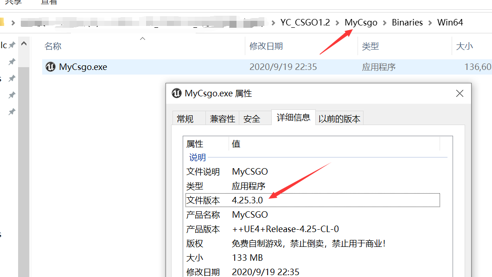
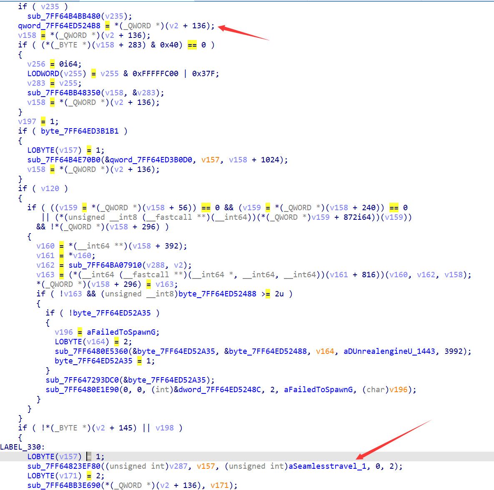
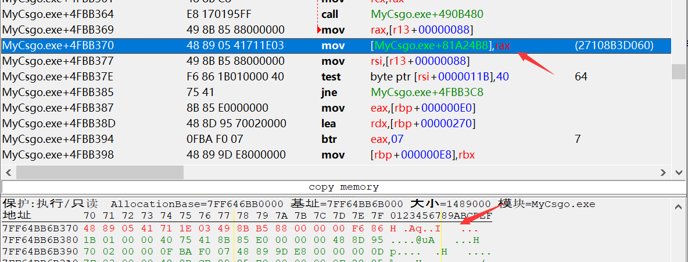

# UE4

UE4以4.23版本为分界线，4.23以及上的版本代码出现了大幅度的改变，很多方法不通用。

对于一款UE4写的游戏，在游戏目录下找“游戏名称”-Binaries，就能找到游戏本体，右键查看属性-详细信息，能看到使用的UE4版本




## UE4引擎名词

**UObject**：引擎对象的最小单位，只有继承了这个类，才会被UE4认为是一个引擎对象

**UWorld**：游戏主场景。比如游戏准备界面是一个主场景、进入游戏又是另一个主场景

**Actor**：在UE4里面其实不是某种具体化的3D世界里的对象，而是世界里面的种种元素，用更泛化的抽象概念来看，比如地上的石头，或者是整个世界的运行规则。其实更像是一个容器

**ULevel**：UE4的场景划分模式是基于子关卡来做的（UWorld包含了ULevel），支持游戏场景中物理的动态加载与卸载。动态加载卸载的子关卡叫做流关卡（StreamingLevel，`ULevelStreaming`类），一开始就夹在的子关卡叫做持久关卡（PersistentLevel）。场景中的具体物件都是放在关卡中的（Ulevel包含了Actor链表）

**RootComponent**：对象的根组件，里面有对象的位置信息

**GObject**：记录着UE4所有类的对象，比如：玩家类、引擎类、物品类

**GName**：由于C++没有反射机制，所以UE4自己实现了反射   其中所有类、字段等字符串信息都存在与GName中

## 获取UE4三件套

### UWorld

由源码索引得知，UWorld实例存放在`UWorldProxy`类中，是类的第一个成员

```cpp
// World.h
// .line 146
class UWorldProxy
{
public:

	UWorldProxy() :
		World(NULL)
	{}

	inline UWorld* operator->()
	{
		// GWorld is changed often on the game thread when in PIE, accessing on any other thread is going to be a race condition
		// In general, the rendering thread should not dereference UObjects, unless there is a mechanism in place to make it safe	
		checkSlow(IsInGameThread());							
		return World;
	}

	inline const UWorld* operator->() const
	{
		checkSlow(IsInGameThread());
		return World;
	}

	inline UWorld& operator*()
	{
		checkSlow(IsInGameThread());
		return *World;
	}

	inline const UWorld& operator*() const
	{
		checkSlow(IsInGameThread());
		return *World;
	}

	inline UWorldProxy& operator=(UWorld* InWorld)
	{
		World = InWorld;
		return *this;
	}

	inline UWorldProxy& operator=(const UWorldProxy& InProxy)
	{
		World = InProxy.World;
		return *this;
	}

	inline bool operator==(const UWorldProxy& Other) const
	{
		return World == Other.World;
	}

	inline operator UWorld*() const
	{
		checkSlow(IsInGameThread());
		return World;
	}

	inline UWorld* GetReference() 
	{
		checkSlow(IsInGameThread());
		return World;
	}

private:

	UWorld* World; // 第一个成员，前边都是函数。
};
```

这个类的实例叫做GWorld

```cpp
// World.cpp
// .line 311
/** Global world pointer */
UWorldProxy GWorld;
```

既然实例在这里，这个cpp文件里面应该就有对实例赋值的地方，直接在World.cpp里面搜索GWorld，找到如下代码

```cpp
// World.cpp
// .line 6352
			// set GWorld to the new world and initialize it
			GWorld = LoadedWorld;
			if (!LoadedWorld->bIsWorldInitialized)
			{
				LoadedWorld->InitWorld();
			}
			bWorldChanged = true;
			// Track session change on seamless travel.
			NETWORK_PROFILER(GNetworkProfiler.TrackSessionChange(true, LoadedWorld->URL));


			checkSlow((LoadedWorld->GetNetMode() == NM_Client) == bIsClient);

			if (bCreateNewGameMode)
			{
				LoadedWorld->SetGameMode(PendingTravelURL);
			}

			// if we've already switched to entry before and this is the transition to the new map, re-create the gameinfo
			if (bSwitchedToDefaultMap && !bIsClient)
			{
				if (FAudioDevice* AudioDevice = LoadedWorld->GetAudioDeviceRaw())
				{
					AudioDevice->SetDefaultBaseSoundMix(LoadedWorld->GetWorldSettings()->DefaultBaseSoundMix);
				}

				// Copy cheat flags if the game info is present
				// @todo UE4 FIXMELH - see if this exists, it should not since it's created in GameMode or it's garbage info
				if (LoadedWorld->NetworkManager != nullptr)
				{
					LoadedWorld->NetworkManager->bHasStandbyCheatTriggered = bHasStandbyCheatTriggered;
				}
			}

			// Make sure "always loaded" sub-levels are fully loaded
			{
				SCOPE_LOG_TIME_IN_SECONDS(TEXT("    SeamlessTravel FlushLevelStreaming "), nullptr)
				LoadedWorld->FlushLevelStreaming(EFlushLevelStreamingType::Visibility);	
			}
			
```

并且在这串代码附近找到了字符串`SeamlessTravel FlushLevelStreaming`，这样就可以通过dump内存，拖进IDA来定位代码了。

使用xdbg64附加进程，用Scylla插件来dump内存，然后拖进IDA（这一步很费时间，但是解析到一半就可以直接找字符串和交叉索引了），然后F5查看伪代码网上找



如图，现在的GWorld为7FF64ED524B8，因为不是基址，重启游戏之后就会改变，所以使用特征码的方式来定位这个赋值语句



特征码取10字节，然后把参数部分用问号通配，得到特征码

```
48 89 05 ?? ?? ?? ?? 49 8B B5 ?? ?? ?? ?? F6 86
```

注意扫描的时候勾选扫描MEM_MAPPED内存区域，并且可写选项变为实心


反汇编这块内存区域


这里得到的是GWorld，读一层就是UWorld了

### GName

#### 反射机制

（UE4版本为4.25 新算法）

因为UE4自己实现了反射，所以一定有个地方存储着所有的符号，并且还有寻找符号的算法

具体函数为`GetName`() 在`Engine\Source\Runtime\CoreUObject\Public\UObject\UObjectBaseUtility.h`路径文件里

```cpp
// UObjectBaseUtility.h
// .line 384
FORCEINLINE FString GetName() const
{
    return GetFName().ToString();
}
```

其中`GetName()`返回了一个FName，`ToString()`里边才有算法，不过`ToString()`需要找FName中的函数，并且找到其具体的实现

```cpp
// UnrealNames.cpp
// .line 2033
FString FName::ToString() const
{
	if (GetNumber() == NAME_NO_NUMBER_INTERNAL)
	{
		// Avoids some extra allocations in non-number case
		return GetDisplayNameEntry()->GetPlainNameString();
	}
	
	FString Out;	
	ToString(Out);
	return Out;
}
```

逻辑在`GetDisplayNameEntry()`中

```cpp
// UnrealNames.cpp
// .line 2028
const FNameEntry* FName::GetDisplayNameEntry() const
{
	return &GetNamePool().Resolve(GetDisplayIndex());
}
```

由此可以推断出`GetNamePool()`就是GName

这里奇怪的是`GetDisplayIndex()`返回的是`FNameEntryId`类型

但是`Resolve`函数原型为

```cpp
FNameEntry&		Resolve(FNameEntryHandle Handle) const;
```

但是确实`FNameEntryId`和`FNameEntryHandle`可以相互转换，可能是c++特性在强制转换类型的时候调用了转换函数

```cpp
// UnrealNames.cpp
// .line 176
enum { FNameBlockOffsetBits = 16 };
enum { FNameBlockOffsets = 1 << FNameBlockOffsetBits };
struct FNameEntryHandle
{
	uint32 Block = 0;
	uint32 Offset = 0;

	FNameEntryHandle(uint32 InBlock, uint32 InOffset)
		: Block(InBlock)
		, Offset(InOffset)
	{}

	FNameEntryHandle(FNameEntryId Id) // 转换函数
		: Block(Id.ToUnstableInt() >> FNameBlockOffsetBits)
		, Offset(Id.ToUnstableInt() & (FNameBlockOffsets - 1))
	{}

	operator FNameEntryId() const
	{
		return FNameEntryId::FromUnstableInt(Block << FNameBlockOffsetBits | Offset);
	}

	explicit operator bool() const { return Block | Offset; }
};
```

`FNameEntryId`可以看作是index，而`FNameEntryHandle`可以看作是对index的解析

再看`Resolve`函数的内容

```cpp
FNameEntry&		Resolve(FNameEntryHandle Handle) const { return Entries.Resolve(Handle); }

// Stride = 4
FNameEntry& Resolve(FNameEntryHandle Handle) const
	{
		// Lock not needed
		return *reinterpret_cast<FNameEntry*>(Blocks[Handle.Block] + Stride * Handle.Offset);
	}
```

这是4.23之后版本的实现，可能因为Names数量增多不得不增加新的NamesTable，在4.23以前只有一个Table，并且实现也没有这么繁琐，直接使用index来找到相应的Name，如下


#### 获取方法

已知`GetNamePool()`就是GName，该函数返回类型为`FNamePool`，查看该结构

```cpp
class FNamePool
{
    // 删除了函数代码
private:
	enum { MaxENames = 512 }; // 枚举变量在结构体内不占空间

	FNameEntryAllocator Entries;

#if WITH_CASE_PRESERVING_NAME
	FNamePoolShard<ENameCase::CaseSensitive> DisplayShards[FNamePoolShards];
#endif
	FNamePoolShard<ENameCase::IgnoreCase> ComparisonShards[FNamePoolShards];

	// Put constant lookup on separate cache line to avoid it being constantly invalidated by insertion
	alignas(PLATFORM_CACHE_LINE_SIZE) FNameEntryId ENameToEntry[NAME_MaxHardcodedNameIndex] = {};
	uint32 LargestEnameUnstableId;
	TMap<FNameEntryId, EName, TInlineSetAllocator<MaxENames>> EntryToEName;
};
```

其中Entries内储存了Names信息，继续查看`FNameEntryAllocator`结构

```cpp
class FNameEntryAllocator
{
    // 删除了函数代码
	mutable FRWLock =  Lock; // FRWLock = FPThreadsRWLock  结构体内只有一个指针 8 byte
	uint32 CurrentBlock = 0; // 4 byte
	uint32 CurrentByteCursor = 0; // 4 byte
    // 至此一共 0x10 byte
	uint8* Blocks[FNameMaxBlocks] = {};
};
```

Blocks就是Resolve用到的数组了。

通过在CE里面搜字符串`ByteProperty`，然后一层一层网上找


可以搜到很多结果吗，找到类似这样的一块内存区域（需要由None字符串）

然后字节对齐继续网上搜


找到基址，这里对应的是`&FNameEntryAllocator.Blocks`，这前面存在一个Lock和两个int，一共是0x10字节，所以最后

的地址需要减去0x10

而`FNameEntryAllocator`在`FNamePool`结构中，前面只有一个枚举变量，枚举变量是不占空间的，所以从地址上来说，`FNameEntryAllocator`的地址与`FNamePool`的地址相同。因此`GName = MyCsgo.exe + 0x8011510 - 0x10`

### GObject

