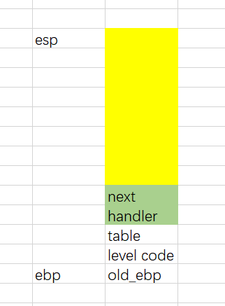
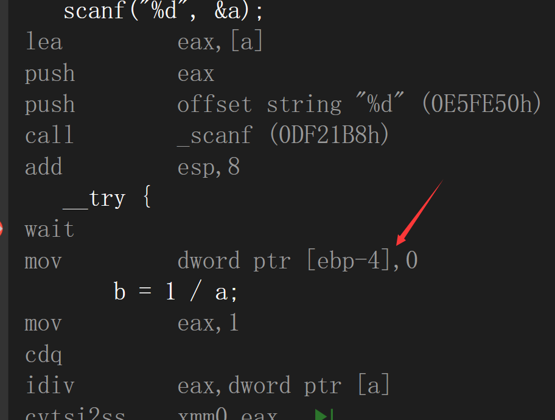
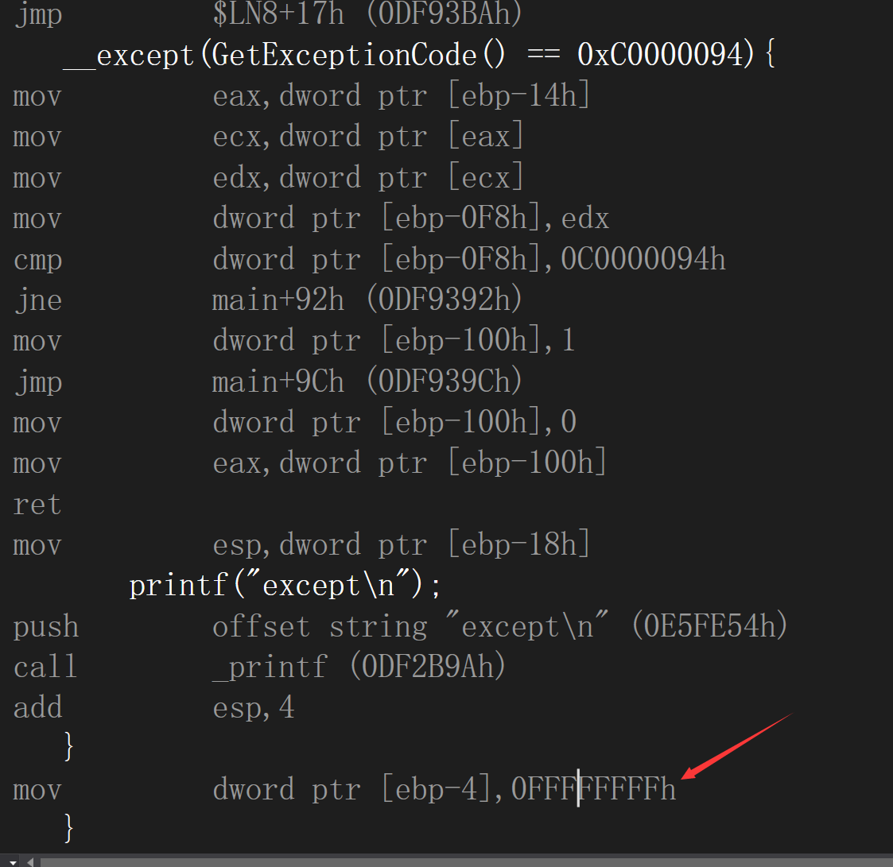
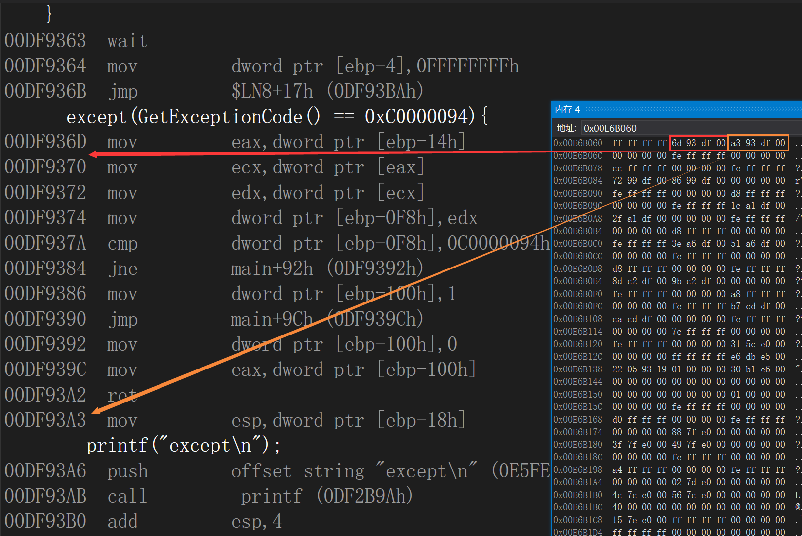
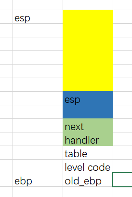
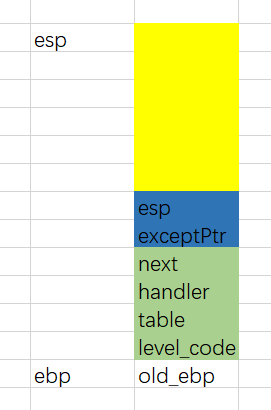

## 写在前面

`try-except`是给编程人员使用的异常处理模板，本质还是使用`SEH`来实现。

## try-except框架

首先是栈的结构，先编译一份带有try-except的简单代码然后下断点到try之前，拷贝一下压栈的汇编

```asm
push        ebp  
mov         ebp,esp  
push        0FFFFFFFFh  ; level code
push        0E6B060h  ; table_arr
push        offset _except_handler3 (0DFBB60h)  ; handler
mov         eax,dword ptr fs:[00000000h]  
push        eax  ; next
mov         dword ptr fs:[0],esp  
add         esp,0FFFFFF10h  
```

现在堆栈情况如下



其中黄色区域为`add esp,0FFFFFF10h `得到的空间，绿色区域是为`try-except`添加的`_EXCEPTION_REGISTRATION_RECORD`结构，如下

```c
typedef struct _EXCEPTION_REGISTRATION_RECORD 
{ 
	struct _EXCEPTION_REGISTRATION_RECORD* Next;	//下一个节点，-1就是没有下一个节点了
	PEXCEPTION_ROUTINE Handler; //指向异常处理函数
} EXCEPTION_REGISTRATION_RECORD;
```

`table_arr`指向`try-except`的一个结构体数组，结构体大概如下

```c
struct table
{
    int lastTryCode; // 上一层try的结构编号
    int lpfnFillter; // 过滤函数的起始地址
    int lpfnHandler; // 异常处理函数的地址
}
```

存在多个`try-except`的时候几个table挨在一起，可以根据try结构的编号来定位其对应的table结构

解释一下`lastTryCode`指的是嵌套关系的上一层，但是try结构的编号是按照出现的先后次序给的（行号），这个编号是编译器分析了整体结构之后固定死写成汇编代码的，并且会在进入或者退出`try-except`结构的时候给予相应的值。

进入时候赋值



退出时候赋值



table_arr内存区域



接着看压栈时候的初始化汇编

```asm
; 紧接 add         esp,0FFFFFF10h
push        ebx  
push        esi  
push        edi  
lea         edi,[ebp-40h]  
mov         ecx,0Ah  
mov         eax,0CCCCCCCCh  
rep stos    dword ptr es:[edi]  
mov         dword ptr [ebp-18h],esp  
```

之后的堆栈情况是这样的



蓝色区域有8字节的大小，从黄色区域分割出来，因为这部分没有被初始化，并且在`ebp-0x18`的地方赋值为了当前的`esp`，这个值在每次`SEH`执行完`_except_handler3`之后都重新赋值给了esp，意思是不论`_except_handler3`里面做了怎样的堆栈操作，退出后都回到原本的`esp`状态

还是用`table_arr`内存区域来展示


可以看到退出时候走的代码是`00DF93A3`，执行了恢复`esp`的代码。

由此可以总结一下，`table.lpfnHandler`是根据`except`条件判断后，决定是否从`SEH`的 `handler`那里接管程序，如果接管了就正常执行后续内容不用跳来跳去，如果不能接管就继续找`SEH`链，走正常的异常流程了。

## __except_handler3

首先通过判断是否要展开讲代码流程分成了两个部分，大多数情况都是走不展开的路线。

其中执行了一些操作使得堆栈发生了变化，变为一下状态



首先是蓝色部分存放了`exceptPtr`指针，指向一个`_EXCEPTION_POINTERS`结构体

```c
typedef struct _EXCEPTION_POINTERS {
  PEXCEPTION_RECORD ExceptionRecord; // __except_handler3的第一个参数
  PCONTEXT          ContextRecord; // __except_handler3的第三个参数
} EXCEPTION_POINTERS, *PEXCEPTION_POINTERS;
```

该结构在进入`__except_handler3`之后马上被初始化。

其次分析代码得知途中绿色部分是对`SEH`链表的拓展

原本是结构`_EXCEPTION_REGISTRATION_RECORD`

```c
typedef struct _EXCEPTION_REGISTRATION_RECORD 
{ 
	struct _EXCEPTION_REGISTRATION_RECORD* Next;	//下一个节点，-1就是没有下一个节点了
	PEXCEPTION_ROUTINE Handler; //指向异常处理函数
} EXCEPTION_REGISTRATION_RECORD;
```

现在的结构`_EH3_EXCEPTION_REGISTRATION`

```c
typedef struct _EH3_EXCEPTION_REGISTRATION{
	struct _EH3_EXCEPTION_REGISTRATION* Next; //下一个节点，-1就是没有下一个节点了
	PVOID Handler; //指向异常处理函数
	PSCOPETABLE_ENTRY ScopeTable; 
	DWORD TryLevel;
}
```

因此可以将触发`__except_handler3`时候的`TryLevel`和`ScopeTable`传入，因为是链表形式存在，正确继承了`next`和`handler`成员，因此可以随意在后面拓展

之后是一个循环，判断当前异常是否可以被`except`接管（执行`ScopeTable[Trylevel].lpfnFilter`），如果不行就把`Trylevel`换成嵌套关系的上一层的`levelCode`，继续判断，直到没有上一层。调用`ScopeTable[Trylevel].lpfnFilter`的时候有个细节是将`ebp`还原成触发异常时候的`ebp`，这样能保证函数内的相对应局部变量是正确的。如果至此没有能接管的，就继续找`SEH`链，走正常的异常流程了。

函数中还有相关结构体、枚举、以及变成时候的定义

```c
typedef struct _EXCEPTION_RECORD {
    NTSTATUS ExceptionCode;
    ULONG ExceptionFlags;
    struct _EXCEPTION_RECORD *ExceptionRecord;
    PVOID ExceptionAddress;
    ULONG NumberParameters;
    ULONG_PTR ExceptionInformation[EXCEPTION_MAXIMUM_PARAMETERS];
    } EXCEPTION_RECORD;
typedef enum _EXCEPTION_DISPOSITION
{
    ExceptionContinueExecution,
    ExceptionContinueSearch,
    ExceptionNestedException,
    ExceptionCollidedUnwind
} EXCEPTION_DISPOSITION;
#define EXCEPTION_NONCONTINUABLE 0x1    // Noncontinuable exception
#define EXCEPTION_UNWINDING 0x2         // Unwind is in progress
#define EXCEPTION_EXIT_UNWIND 0x4       // Exit unwind is in progress
#define EXCEPTION_STACK_INVALID 0x8     // Stack out of limits or unaligned
#define EXCEPTION_NESTED_CALL 0x10      // Nested exception handler call
#define EXCEPTION_TARGET_UNWIND 0x20    // Target unwind in progress
#define EXCEPTION_COLLIDED_UNWIND 0x40  // Collided exception handler call
```


找到了一份[网络](https://www.cnblogs.com/salomon/archive/2012/06/20/2556349.html)上的还原伪代码，可以稍微借鉴一下

```c
View Code 

int __except_handler3(
     struct _EXCEPTION_RECORD * pExceptionRecord,
     struct EXCEPTION_REGISTRATION * pRegistrationFrame,
     struct _CONTEXT *pContextRecord,
     void * pDispatcherContext )
 {
     LONG filterFuncRet
     LONG trylevel
     EXCEPTION_POINTERS exceptPtrs
     PSCOPETABLE pScopeTable
     CLD     // Clear the direction flag (make no assumptions!)
     // if neither the EXCEPTION_UNWINDING nor EXCEPTION_EXIT_UNWIND bit
     // is set...  This is true the first time through the handler (the
     // non-unwinding case)
     if ( ! (pExceptionRecord->ExceptionFlags
             & (EXCEPTION_UNWINDING | EXCEPTION_EXIT_UNWIND)) )
     {
         // Build the EXCEPTION_POINTERS structure on the stack
         exceptPtrs.ExceptionRecord = pExceptionRecord;
         exceptPtrs.ContextRecord = pContextRecord;
         // Put the pointer to the EXCEPTION_POINTERS 4 bytes below the
         // establisher frame.  See ASM code for GetExceptionInformation
         *(PDWORD)((PBYTE)pRegistrationFrame - 4) = &exceptPtrs;
         // Get initial "trylevel" value
         trylevel = pRegistrationFrame->trylevel 
         // Get a pointer to the scopetable array
         scopeTable = pRegistrationFrame->scopetable;
 search_for_handler: 
         if ( pRegistrationFrame->trylevel != TRYLEVEL_NONE )
         {
             if ( pRegistrationFrame->scopetable[trylevel].lpfnFilter )
             {
                 PUSH EBP                        // Save this frame EBP
                 // !!!Very Important!!!  Switch to original EBP.  This is
                 // what allows all locals in the frame to have the same
                 // value as before the exception occurred.
                 EBP = &pRegistrationFrame->_ebp 
                 // Call the filter function
                 filterFuncRet = scopetable[trylevel].lpfnFilter();
                 POP EBP                         // Restore handler frame EBP
                 if ( filterFuncRet != EXCEPTION_CONTINUE_SEARCH )
                 {
                     if ( filterFuncRet < 0 ) // EXCEPTION_CONTINUE_EXECUTION
                         return ExceptionContinueExecution;
                     // If we get here, EXCEPTION_EXECUTE_HANDLER was specified
                     scopetable == pRegistrationFrame->scopetable
                     // Does the actual OS cleanup of registration frames
                     // Causes this function to recurse
                     __global_unwind2( pRegistrationFrame );
                     // Once we get here, everything is all cleaned up, except
                     // for the last frame, where we'll continue execution
                     EBP = &pRegistrationFrame->_ebp
                     __local_unwind2( pRegistrationFrame, trylevel );
                     // NLG == "non-local-goto" (setjmp/longjmp stuff)
                     __NLG_Notify( 1 );  // EAX == scopetable->lpfnHandler
                     // Set the current trylevel to whatever SCOPETABLE entry
                     // was being used when a handler was found
                     pRegistrationFrame->trylevel = scopetable->previousTryLevel;
                     // Call the _except {} block.  Never returns.
                     pRegistrationFrame->scopetable[trylevel].lpfnHandler();
                 }
             }
             scopeTable = pRegistrationFrame->scopetable;
             trylevel = scopeTable->previousTryLevel
             goto search_for_handler;
         }
         else    // trylevel == TRYLEVEL_NONE
         {
             retvalue == DISPOSITION_CONTINUE_SEARCH;
         }
     }
     else    // EXCEPTION_UNWINDING or EXCEPTION_EXIT_UNWIND flags are set
     {
         PUSH EBP    // Save EBP
         EBP = pRegistrationFrame->_ebp  // Set EBP for __local_unwind2
         __local_unwind2( pRegistrationFrame, TRYLEVEL_NONE )
         POP EBP     // Restore EBP
         retvalue == DISPOSITION_CONTINUE_SEARCH;
     }
 }
```

