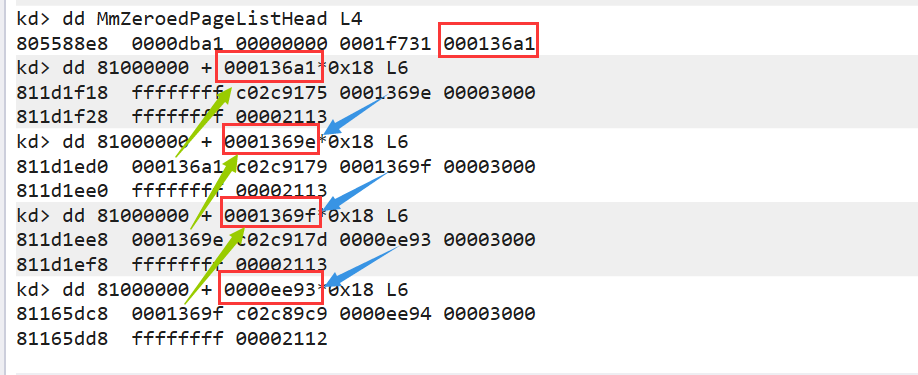

## 物理页表管理者：MmPfnDatabase

之前学习过分页机制，不论是2-9-9-12还是10-10-12分页，都是通过很多张索引表找到的一个页表地址。一个页表管理了`0x1000`大小的物理内存，通过类似页目录表的索引表将物理不相邻的页表联系起来，但也仅供查询。

页表的由**页帧数据库**，一个全局结构体数组来管理，数组指针为`MmPfnDatabase`是一个全局变量。结构体名为`MMPFN`。

## 相关结构体：_MMPFN

每一个物理页都有一个对应的`MMPFN`结构体。并且每一个`MMPFN`结构体之间是物理相邻的。（不同操作系统下的`MMPFN`结构体大小似乎有差异，在`winxp`操作系统下的大小为`0x18`）

```c
// 在windbg中的 _MMPFN 结构如下
nt!_MMPFN
   +0x000 u1               : __unnamed
   +0x004 PteAddress       : Ptr32 _MMPTE
   +0x008 u2               : __unnamed
   +0x00c u3               : __unnamed
   +0x010 OriginalPte      : _MMPTE
   +0x014 u4               : __unnamed
//
// 在wrk v1.2中的 _MMPFN 简化后的结构如下
typedef struct _MMPFN {
    PFN_NUMBER Flink;
    PMMPTE PteAddress;
    PFN_NUMBER Blink;
    u3;
    MMPTE OriginalPte;
    u4;
} MMPFN, *PMMPFN;
```

通过当前`MMPFN`结构体找到对应的**物理页**：`物理页 = _MMPFN索引值 * 0x1000`

通过当前**物理页**找到对应的`MMPFN`结构体：`_MMPFN = (物理页//0x1000) * sizeof(_MMPFN)` 

## 六个链表

`wrk v1.2`中的链表结构如下

```c
typedef struct _MMPFNLIST {
    PFN_NUMBER Total; // 页表总数
    MMLISTS ListName; // 链表昵称，是枚举 _MMLISTS 代表六个链表
    PFN_NUMBER Flink;
    PFN_NUMBER Blink;
} MMPFNLIST;
typedef enum _MMLISTS {
    ZeroedPageList,
    FreePageList,
    StandbyPageList,  //this list and before make up available pages.
    ModifiedPageList,
    ModifiedNoWritePageList,
    BadPageList,
    ActiveAndValid,
    TransitionPage
} MMLISTS;
```

将所有相同类型的物理页通过链表串在一起

### MmZeroedPageListHead

需要新的页表的时候从这里取，里面的页表都是清零了的。

### MmFreePageListHead

被释放的链表放在这里。当该链表中的页表数Total达到一定的阈值的时候，就会清零所有的页表并且放入到`MmZeroedPageListHead`中。

### MmStandbyPageListHead

备用链表，当系统内存不够的时候，操作系统会把物理内存中的数据交换到硬盘上，此时页面不是直接挂到空闲链表上去，而是挂到备用链表上，虽然我释放了，但里边的内容还是有意义的。

### ModifiedPageListHead

A进程用的页表，B进程也用，存放的是修正的页表。

### ModifiedNoWritePageListHead

火哥说似乎没有用到。

### MmBadPageListHead

火哥说似乎没有用到。这是在出现页表异常的时候的页表会进入到这里面，在某一时刻对其修正后进入到`ModifiedNoWritePageListHead`。

## 链表相邻实验

```c
kd> dd MmZeroedPageListHead L4
805588e8  0000dba1 00000000 0001f731 000136a1
//
kd> dd 81000000 + 000136a1*0x18 L6
811d1f18  ffffffff c02c9175 0001369e 00003000
811d1f28  ffffffff 00002113
//
kd> dd 81000000 + 0001369e*0x18 L6
811d1ed0  000136a1 c02c9179 0001369f 00003000
811d1ee0  ffffffff 00002113
//
kd> dd 81000000 + 0001369f*0x18 L6
811d1ee8  0001369e c02c917d 0000ee93 00003000
811d1ef8  ffffffff 00002113
//
kd> dd 81000000 + 0000ee93*0x18 L6
81165dc8  0001369f c02c89c9 0000ee94 00003000
81165dd8  ffffffff 00002112
//
```



## 进程内存管理VAD

每个进程都有一个`VAD`二叉树来维护内存空间，在`EPROCESS`结构的`+0x11c`偏移处

```c
nt!_EPROCESS
// ....
   +0x118 HardwareTrigger  : Uint4B
   +0x11c VadRoot          : Ptr32 Void // _MMVAD结构
   +0x120 VadHint          : Ptr32 Void
// ....
//
//     
nt!_MMVAD
   +0x000 StartingVpn      : Uint4B // 该节点管理的物理地址的开始位置  权值*0x1000
   +0x004 EndingVpn        : Uint4B // 该节点管理的物理地址的结束位置  权值*0x1000
// 上机发现 左节点管理的空间地址都小于该节点   右节点管理的空间地址都大于该节点  属于典型的搜索二叉树了
   +0x008 Parent           : Ptr32 _MMVAD // 父节点
   +0x00c LeftChild        : Ptr32 _MMVAD // 左节点
   +0x010 RightChild       : Ptr32 _MMVAD // 右节点
   +0x014 u                : __unnamed  // 联合体 _MMVAD_FLAGS 描述内存使用情况
   +0x018 ControlArea      : Ptr32 _CONTROL_AREA  // 一些属性 只有LoadLibraryA映射的mapped才有
   +0x01c FirstPrototypePte : Ptr32 _MMPTE
   +0x020 LastContiguousPte : Ptr32 _MMPTE
   +0x024 u2               : __unnamed
//
//
nt!_MMVAD_FLAGS
   +0x000 CommitCharge     : Pos 0, 19 Bits // 已经commit的物理页个数
   +0x000 PhysicalMapping  : Pos 19, 1 Bit
   +0x000 ImageMap         : Pos 20, 1 Bit
   +0x000 UserPhysicalPages : Pos 21, 1 Bit
   +0x000 NoChange         : Pos 22, 1 Bit
   +0x000 WriteWatch       : Pos 23, 1 Bit
   +0x000 Protection       : Pos 24, 5 Bits
   +0x000 LargePages       : Pos 29, 1 Bit
   +0x000 MemCommit        : Pos 30, 1 Bit
   +0x000 PrivateMemory    : Pos 31, 1 Bit  // 是否为私有空间  Private/Mapped 
```

`!vad`指令可以遍历二叉树的所有结点并且输出信息 例如

```c
kd> !vad 0x82099950
VAD   Level     Start       End Commit
8205b768  1        10        10      1 Private      READWRITE          
82057cd8  2        20        20      1 Private      READWRITE          
82099950  0        30       12f      4 Private      READWRITE          
820a4300  3       130       132      0 Mapped       READONLY           Pagefile section, shared commit 0x3
82055a48  2       140       23f      9 Private      READWRITE          
81e10298  4       240       24f      6 Private      READWRITE          
81dce770  3       250       25f      0 Mapped       READWRITE          Pagefile section, shared commit 0x3
820a9d28  5       260       275      0 Mapped       READONLY           \WINDOWS\system32\unicode.nls
81ec52a8  4       280       2c0      0 Mapped       READONLY           \WINDOWS\system32\locale.nls
81eb3d38  6       2d0       310      0 Mapped       READONLY           \WINDOWS\system32\sortkey.nls
81d54fd8  5       320       325      0 Mapped       READONLY           \WINDOWS\system32\sorttbls.nls
821a3940  7       330       370      0 Mapped       READONLY           Pagefile section, shared commit 0x41
82075220  6       380       38f      5 Private      READWRITE          
81de9540  7       390       392      0 Mapped       READONLY           \WINDOWS\system32\ctype.nls
821de130  8       3a0       3ad      0 Mapped       READWRITE          Pagefile section, shared commit 0xe
822e8fc0  9       3b0       3b0      1 Private      READWRITE          
81eb3250  1       400       42d      7 Mapped  Exe  EXECUTE_WRITECOPY  \Documents and Settings\Administrator\桌面\test.exe
81eebd28  4     76d70     76d91      2 Mapped  Exe  EXECUTE_WRITECOPY  \WINDOWS\system32\apphelp.dll
821aaac8  5     77bd0     77bd7      2 Mapped  Exe  EXECUTE_WRITECOPY  \WINDOWS\system32\version.dll
821962d8  6     77da0     77e48      6 Mapped  Exe  EXECUTE_WRITECOPY  \WINDOWS\system32\advapi32.dll
821a3068  7     77e50     77ee2      2 Mapped  Exe  EXECUTE_WRITECOPY  \WINDOWS\system32\rpcrt4.dll
820631a0  8     77fc0     77fd0      2 Mapped  Exe  EXECUTE_WRITECOPY  \WINDOWS\system32\secur32.dll
81eade70  3     7c800     7c91d      6 Mapped  Exe  EXECUTE_WRITECOPY  \WINDOWS\system32\kernel32.dll
81de8c70  2     7c920     7c9b2      5 Mapped  Exe  EXECUTE_WRITECOPY  \WINDOWS\system32\ntdll.dll
821a1588  4     7f6f0     7f7ef      0 Mapped       EXECUTE_READ       Pagefile section, shared commit 0x7
81de0490  3     7ffa0     7ffd2      0 Mapped       READONLY           Pagefile section, shared commit 0x33
81eb3da8  4     7ffd6     7ffd6      1 Private      READWRITE          
81eae990  5     7ffdf     7ffdf      1 Private      READWRITE      
```

`Level` 指的是树的深度  根节点的深度为0

`Start` 和 `End` 对应` _MMVAD`结构里面的 `StartingVpn` 和 `EndingVpn` 

`Commit` 该申请空间有多少页是已经被`malloc`了的，也可以说是有多少页有`MEM_COMMIT`属性。具体阐述见下文`VirtualAlloc`分析。

`Private/Mapped` 表示该物理页是私有的还是映射的 并且某些映射文件会在后面出现文件路径（通过`_MMVAD`里面的`_CONTROL_AREA`里面的`FilePointer`拿到指向映射文件的`_FILE_OBJECT`，然后就可以获取偏移为`0x30`的`FileName`了）

`Exe`表示映射的PE文件

`EXECUTE_WRITECOPY/READONLY/READWRITE` 是权限   来自`_MMVAD`偏移为`0x14`的`_MMVAD_FLAGS`结构中

## 遍历VAD二叉树实验

```c
#include <ntddk.h>
typedef struct _MMVAD
{
	ULONG StartingVpn;
	ULONG EndingVpn;
	struct _MMVAD* Parent;
	struct _MMVAD* LeftChild;
	struct _MMVAD* RightChild;
	ULONG u;
	ULONG ControlArea;
	ULONG FirstPrototypePte;
	ULONG LastContiguousPte;
	ULONG u2;
}MMVAD;
typedef MMVAD* PMMVAD;
VOID DriverUnload(PDRIVER_OBJECT driver)
{
	DbgPrint("卸载了\n");
}
VOID FindTree(PMMVAD Root, ULONG dep)
{
	if (Root->LeftChild != NULL)
		FindTree(Root->LeftChild, dep + 1);

	DbgPrint("[VAD]:%x\t[dep]:%x\t[Start]:%x\t[End]:%x\t\n", (ULONG)Root, dep, Root->StartingVpn, Root->EndingVpn);

	if (Root->RightChild != NULL)
		FindTree(Root->RightChild, dep + 1);
}
NTSTATUS DriverEntry(PDRIVER_OBJECT driver, PUNICODE_STRING reg_path)
{
	DbgPrint("hello world!\n");
	driver->DriverUnload = DriverUnload;
	ULONG PspCidTable;
	_asm
	{
		mov eax, fs: [0x34]
		mov eax, [eax + 0x80]
		mov eax, [eax]
		mov eax, [eax]             //两次取值直接拿首地址 
		mov PspCidTable, eax
	}
	ULONG PID = 1724;
	ULONG PRO = ((*(PULONG)(PspCidTable + PID * 2)) & 0xfffffffc); // 全局句柄表找到进程句柄  后两位置0
	ULONG VadRoot = *(PULONG)(PRO + 0x11c);
	DbgPrint("VadRoot : %x\n", VadRoot);
	FindTree((PMMVAD)VadRoot,0);
	return STATUS_SUCCESS;
}
```

## VirtualAlloc详解

函数原型如下：

```c
LPVOID __stdcall VirtualAlloc(
    LPVOID lpAddress, 
    SIZE_T dwSize, 
    DWORD flAllocationType, 
    DWORD flProtect);

```

`lpAddress`是指定分配虚拟地址，为NULL时系统自动分配

`dwSize`是分内存大小，单位是byte

`flAllocationType`很有说法，一般使用的是`MEM_RESERVE`和`MEM_COMMIT`。`MEM_RESERVE`的意思是保留这块空间，但是不对其提交（挂物理页），所以这些内存是不能通过`PTE`找到的。`MEM_COMMIT`的意思是提交这块空间，挂上物理页，可以通过`PTE`找到。所以`malloc`和平时使用时候给函数的参数都是`MEM_COMMIT|MEM_RESERVE`这等价于直接用`MEM_COMMIT`，可以申请后马上使用。在前文提到的`MMVAD`结构中`MMVAD_FLAGS`结构里面的`CommitCharge`就是指已经commit的物理页个数。

`flProtect`，页保护属性，一般为`PAGE_READWRITE`。没什么好说的。

## VirtualAlloc实验

```c
// winxp vc++ 6.0  双机 win preview
#include <stdio.h>
#include <stdlib.h>
#include <windows.h>
int main()
{
	int* p;
	system("pause");
	p = (int*)VirtualAlloc(NULL,0x3000,MEM_RESERVE,PAGE_READWRITE);
	printf("p : %x\n",p);
	system("pause");
	p = (int*)VirtualAlloc(p,0x1000,MEM_COMMIT,PAGE_READWRITE);
	system("pause");

	return 0;
}
```

先运行起来停在第一个pause

```c
kd> dt _EPROCESS 8206d430 | vadroot
nt!_EPROCESS
   +0x11c VadRoot : 0x81d52150 Void
//
kd> !vad 0x81d52150
// ....
Total VADs: 28, average level: 5, maximum depth: 9
//
```

继续运行停在第二个pause

```c
kd> !vad 0x81d52150
// ....
VAD   Level     Start       End Commit
81eac6a0 10       3c0       3c2      0 Private      READWRITE  // 多出这一个MMVAD  commit=0
// ....
Total VADs: 29, average level: 5, maximum depth: 10  // 28变为29 多出一个
//
//
kd> dt _mmvad_flags 81eac6a0+14
nt!_MMVAD_FLAGS
   +0x000 CommitCharge     : 0y0000000000000000000 (0)  // commit = 0
   +0x000 PhysicalMapping  : 0y0
   +0x000 ImageMap         : 0y0
   +0x000 UserPhysicalPages : 0y0
   +0x000 NoChange         : 0y0
   +0x000 WriteWatch       : 0y0
   +0x000 Protection       : 0y00100 (0x4)
   +0x000 LargePages       : 0y0
   +0x000 MemCommit        : 0y0
   +0x000 PrivateMemory    : 0y1     // private
```

继续运行到第三个pause

```c
kd> !vad 0x81d52150
// ....
VAD   Level     Start       End Commit
81eac6a0 10       3c0       3c2      1 Private      READWRITE     // commit 变为 1
// ....
//
//
kd> dt _mmvad_flags 81eac6a0+14
nt!_MMVAD_FLAGS
   +0x000 CommitCharge     : 0y0000000000000000001 (0x1)   // commit = 1
   +0x000 PhysicalMapping  : 0y0
   +0x000 ImageMap         : 0y0
   +0x000 UserPhysicalPages : 0y0
   +0x000 NoChange         : 0y0
   +0x000 WriteWatch       : 0y0
   +0x000 Protection       : 0y00100 (0x4)
   +0x000 LargePages       : 0y0
   +0x000 MemCommit        : 0y0
   +0x000 PrivateMemory    : 0y1           // private

```

## mapped内存

mapped内存分为两种，一种是通过`CreateFileMappingA`创建的映射，这种映射是没有`_CONTROL_AREA`结构体的；另一个是通过`LoadLibraryA`创建的映射，有`_CONTROL_AREA`结构体。

```c
kd> dt _CONTROL_AREA
nt!_CONTROL_AREA
   +0x000 Segment          : Ptr32 _SEGMENT
   +0x004 DereferenceList  : _LIST_ENTRY
   +0x00c NumberOfSectionReferences : Uint4B
   +0x010 NumberOfPfnReferences : Uint4B
   +0x014 NumberOfMappedViews : Uint4B
   +0x018 NumberOfSubsections : Uint2B
   +0x01a FlushInProgressCount : Uint2B
   +0x01c NumberOfUserReferences : Uint4B
   +0x020 u                : __unnamed
   +0x024 FilePointer      : Ptr32 _FILE_OBJECT   // 由LoadLibraryA 映射的mapped指向相应的文件 
			// 由 CreateFileMappingA 映射的文件为pagefile.sys 可能在C盘根目录下 可能在D盘根目录下
   +0x028 WaitingForDeletion : Ptr32 _EVENT_COUNTER
   +0x02c ModifiedWriteCount : Uint2B
   +0x02e NumberOfSystemCacheViews : Uint2B
// 
kd> dt _SEGMENT
nt!_SEGMENT 
   +0x000 ControlArea      : Ptr32 _CONTROL_AREA   // 指回去
   +0x004 TotalNumberOfPtes : Uint4B       // 该vad下的所有pte的数量  而已用于遍历pte判断边界
   +0x008 NonExtendedPtes  : Uint4B
   +0x00c WritableUserReferences : Uint4B
   +0x010 SizeOfSegment    : Uint8B             // 这个段的大小，比如mapped image的大小
   +0x018 SegmentPteTemplate : _MMPTE
   +0x01c NumberOfCommittedPages : Uint4B
   +0x020 ExtendInfo       : Ptr32 _MMEXTEND_INFO
   +0x024 SystemImageBase  : Ptr32 Void
   +0x028 BasedAddress     : Ptr32 Void        // 映射文件的首地址  一般LoadLibraryA映射进来的文件才有该值
   +0x02c u1               : __unnamed
   +0x030 u2               : __unnamed
   +0x034 PrototypePte     : Ptr32 _MMPTE  // 和MMVAD结构里面的FirstPrototypePte指向同一个地址
   +0x038 ThePtes          : [1] _MMPTE  // 该vad下的所有pte
```

## 遍历所有进程方法总结（题外话）

```c
+0x088 ActiveProcessLinks : _LIST_ENTRY 
+0x0b4 SessionProcessLinks : _LIST_ENTRY
+0x1f8 Vm               : _MMSUPPORT
---- +0x024 WorkingSetExpansionLinks : _LIST_ENTRY
```


## 参考博客

https://blog.csdn.net/qq_41988448/article/details/112600554

