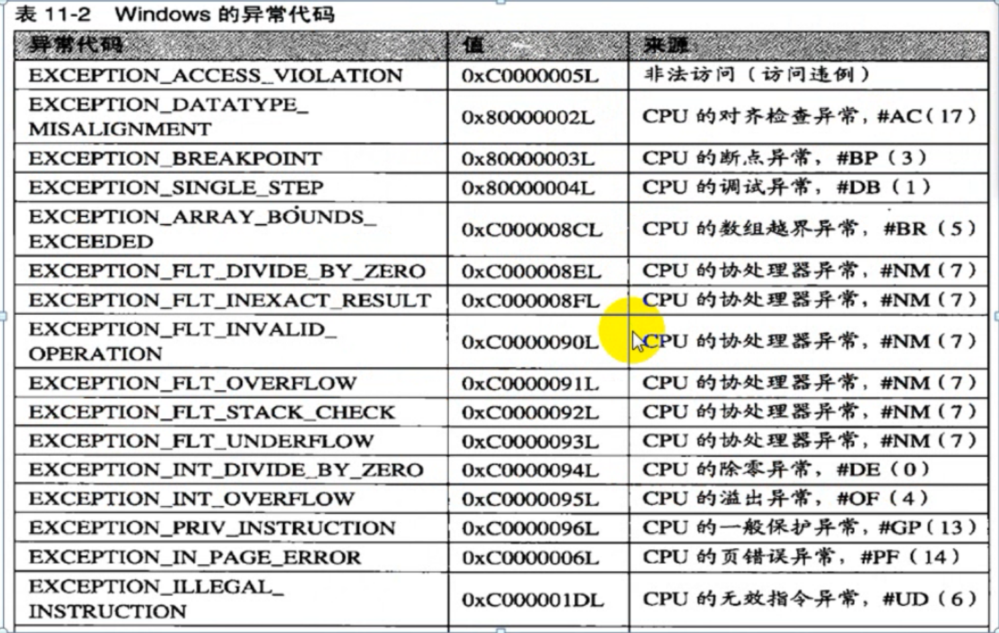

## 准备

**异常进入R0的时候，ESP指向 _KTRAP_FRAME 的+0x64（ErrCode）位置**



## 异常分类

### 错误类

比如**除0**错误，此时记录的异常地址为异常指令的地址

```asm
mov ecx,0
div ecx  // 触发异常               //  << 异常地址指向这里
mov edx,ecx 
```

### 陷阱类

比如`int3`异常，此时记录的异常地址为异常指令的下一条指令

```asm
xor eax,eax
int 3   // 触发异常
xor eax,eax                      // << 异常地址指向这里
```

### 中止类

直接蓝屏了 ，没有更多的操作空间。

## CPU异常流程

通过异常指令跳转，比如**除0**异常就是`int 0`，断点就是`int 3`，通过`IDT`表跳转到`R0`中相应的处理函数去

接着处理函数中调用`CommonDispatchException`，初始化名为`_EXCEPTION_RECORD`的结构体，这个结构体用来记录异常信息，如下

```c
nt!_EXCEPTION_RECORD      // 大小为 0x50   异常处理中如果堆栈提升0x50一般就是要初始化这个结构了
   +0x000 ExceptionCode    : Int4B  // 错误码
   +0x004 ExceptionFlags   : Uint4B  // ExceptionFlags=0   为CPU异常
                 //try、throw 这类出发的是软件模拟异常 此时ExceptionFlags=1
   +0x008 ExceptionRecord  : Ptr32 _EXCEPTION_RECORD
   +0x00c ExceptionAddress : Ptr32 Void     // 异常地址
   +0x010 NumberParameters : Uint4B    // 参数个数 参数存在ExceptionInformation中
   +0x014 ExceptionInformation : [15] Uint4B  // 参数数组 
```

在`CommonDispatchException`里面最后调用`_KiDispatchException`来派发异常

## 软件模拟异常流程

`try`、`throw` 这类出发的是软件模拟异常，此时`_EXCEPTION_RECORD`结构中的`ExceptionFlags` 为 1 

以`throw`为例子  首先调用`CxxThrowException` 

然后调用`kernel32.dll`的`RaiseException`，这里面初始化`_EXCEPTION_RECORD`结构，并且判断了一下`NumberParameters`也就是参数个数，有参数的情况多了一些处理（如果参数个数超过了15个就修复为15个，而不会报错）

然后调用`ntdll.dll`的`RtlRaiseException`，这里面初始化了`_CONTEXT`结构

```c
#define CONTEXT_i386    0x00010000    // this assumes that i386 and
#define CONTEXT_i486    0x00010000    // i486 have identical context records
#define CONTEXT_CONTROL         (CONTEXT_i386 | 0x00000001L) // SS:SP, CS:IP, FLAGS, BP
#define CONTEXT_INTEGER         (CONTEXT_i386 | 0x00000002L) // AX, BX, CX, DX, SI, DI
#define CONTEXT_SEGMENTS        (CONTEXT_i386 | 0x00000004L) // DS, ES, FS, GS
#define CONTEXT_FLOATING_POINT  (CONTEXT_i386 | 0x00000008L) // 387 state  浮点寄存器
#define CONTEXT_DEBUG_REGISTERS (CONTEXT_i386 | 0x00000010L) // DB 0-3,6,7 调试寄存器
#define CONTEXT_EXTENDED_REGISTERS  (CONTEXT_i386 | 0x00000020L) // cpu specific extensions 扩展寄存器

nt!_CONTEXT
   +0x000 ContextFlags     : Uint4B     // 标志位 表示整个结构中哪些部分是有效的
// 当ContextFlags包含 CONTEXT_DEGUB_REGISTERS 时，以下部分有效
   +0x004 Dr0              : Uint4B
   +0x008 Dr1              : Uint4B
   +0x00c Dr2              : Uint4B
   +0x010 Dr3              : Uint4B
   +0x014 Dr6              : Uint4B
   +0x018 Dr7              : Uint4B
// 当ContextFlags包含 CONTEXT_FLOATING_POINT 时，以下部分有效
   +0x01c FloatSave        : _FLOATING_SAVE_AREA
// 当ContextFlags包含 CONTEXT_SEGMENTS 时，以下部分有效
   +0x08c SegGs            : Uint4B
   +0x090 SegFs            : Uint4B
   +0x094 SegEs            : Uint4B
   +0x098 SegDs            : Uint4B
// 当ContextFlags包含 CONTEXT_INTEGER 时，以下部分有效
   +0x09c Edi              : Uint4B
   +0x0a0 Esi              : Uint4B
   +0x0a4 Ebx              : Uint4B
   +0x0a8 Edx              : Uint4B
   +0x0ac Ecx              : Uint4B
   +0x0b0 Eax              : Uint4B
// 当ContextFlags包含 CONTEXT_CONTROL 时，以下部分有效
   +0x0b4 Ebp              : Uint4B
   +0x0b8 Eip              : Uint4B
   +0x0bc SegCs            : Uint4B
   +0x0c0 EFlags           : Uint4B
   +0x0c4 Esp              : Uint4B
   +0x0c8 SegSs            : Uint4B
// 当ContextFlags包含 CONTEXT_EXTENDED_REGISTERS 时，以下部分有效
   +0x0cc ExtendedRegisters : [512] UChar
```

然后调用`ntdll.dll`的`ZwRaiseException` ，就是普通的函数调用，自己的`winxp`里面的调用号为`0xb5` 

然后通过系统调用进入`R0`，执行`NtRaiseException` 这里面什么都没做直接调用下一个函数

然后调用`KiRaiseException ` 这里面检查了一下`ExceptionRecord`、`ContextRecord`、还有一个不清楚什么东西是否为用户态的线性地址（`MmUserProbeAddress`）

最后调用`KiDispatchException`派发异常  

## 内核态异常派发流程

用户态异常的处理有：内核调试器处理`_KiDebugRoutine`、`SEH`处理`_RtlDispatchException`。

首先是给了两次处理异常的机会，两次都是先判断是否存在内核调试器，存在的话先让内核调试器取处理。但是第二次是没有给`SEH`处理的机会的。

`_RtlDispatchException`中先进行一系列的检查，比如堆栈权限的检查之类的，期间取出异常链表第一个节点。链表结构如下

```c
nt!_EXCEPTION_REGISTRATION_RECORD
   +0x000 Next             : Ptr32 _EXCEPTION_REGISTRATION_RECORD
   +0x004 Handler          : Ptr32     _EXCEPTION_DISPOSITION 
// 第一个变量指向下一个相同结构 第二个变量是异常的处理函数，同时也是执行处理函数后的返回值
```

之后就是遍历异常链表里面所有的节点，看是否能有节点能处理该异常，《软件调试（第二版）卷B》中给出了伪代码如下：

```c++
bool RtlDispatchException(PEXCEPTION_RECORD ExceptionRecord,
                          PCONTEXT ContextRecord)
{
    for(RegistartionPointer = RtlpGetRegistrationHead();
       RegistartionPointer != EXECPTION_CHAIN_END;
       RegistartionPointer = RegistartionPointer->Next)
    {

        // code : 检查异常注册记录的有效性，如果有效则调用其记录的处理函数
        // 具体怎么检查有效性     还不会！
        
        switch RtlpExecuteHandlerForException() // 判断执行结果
        {
                case ExceptionContinueExecution: return true; // 异常已处理 返回真
                case ExceptionContinueSearch: continue;  // 没有处理 继续寻找
                case ExceptionNestedException: ...; // 内嵌异常 特殊处理
                default: return false;
        }
    }
    return false;
}
```

没有能正常处理异常就返回`false`了

如果是正常处理了异常之后，通过系统调用的退出函数`KiServiceExit`来返回到R3，具体返回的地址就在`TRAP_FRAME`结构里面。

大致调用路线用伪代码模拟一下

```python
def KiDispatchException:
    if KiDebugRoutine == true: 		# 第一次  内核调试器处理
        ret * n
        KiServiceExit
    elif RtlDispatchException == true: # 第一次 SEH处理  
        ret * n
        KiServiceExit
    elif KiDebugRoutine == true: 		# 第二次 内核调试器处理
        ret * n   # 这里要先返回几层函数 才会执行KiServiceExit
        KiServiceExit
    else: 								# 全部失败 蓝屏函数
        KeBugCheckEx
    
```


## 用户态异常派发流程


